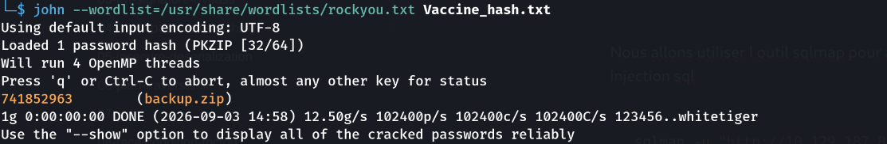

About

Vaccine is a very easy Linux machine that emphasizes enumeration and password cracking. Anonymous FTP access exposes a password-protected backup archive which can be cracked to recover web application credentials. These credentials grant access to a PHP application vulnerable to SQL injection which leads to command execution and an initial shell as the postgres user. Finally, privilege escalation can be achieved by abusing misconfigured sudo permissions on vi.

Enumeration 

- Scan nmap 

```
nmap -sC -sV -p- <IP>
```

Resultat 

On a 3 ports 
- Le port 22 pour le service ssh 
- Le port 21 pour le service FTP . Grace a l option `-sC` on voit que le serveur accepete l authentification anonymous et on aussi un utilisateur ftpuser avec un timeout
- le Port 80 pour un service HTTP 

2. Connexion FTP 

Lorsqu on se connecte en ftp en mode anonymous 
```bash
ftp <IP> 21
# username anonymous 
# password anonymous
```

On remarque qu on a un fichier interressant backup.zip qui contient problement les sauvegardes alors nous allons utiliser la commande `get` de ftp pour le recuperer localement 

```bash
get backup.zip
```

Lorsqu on essaye de decompresser le fichier zip nous remarquons qu il est proteger par un mot de passe. Nous allons utiliser le script de john qui le `zip2john` pour le cracker 

- transformer en hash
```bash
zip2john backup.zip > vaccine_hash.txt 
```

- cracking 

```bash
john --wordlist==/usr/share/wordlists/rockyou.txt
```

Boom  on a le mot de passe cracker 



mot de passe **741852963**

Une fois decompresser on a un ``index.php`` puis ``style.css``

En inpesctant le index.php on remarque que les identifiants de login sont coder en dure mais a la difference est que le mot de passe est hash avec le MD5 qui est obselete
