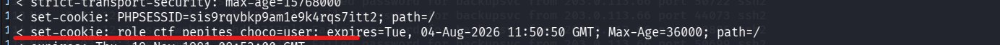
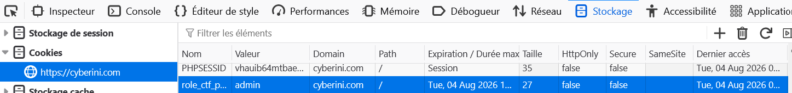
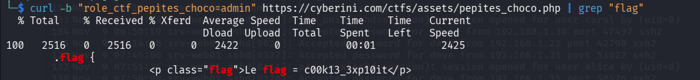

## 📌 Aperçu du Challenge
- **Plateforme :** Cyberini CTF
- **Catégorie :** Web
- **Vulnérabilité :** Manipulation de Cookie (Broken Access Control)
- **Flag :** `c00k13_3xp10it`

---

##  Analyse de la vulnérabilité

L'analyse des en-têtes HTTP de la réponse serveur (via `curl -v` ou l'onglet Réseau/Network du navigateur) révèle que le serveur définit un cookie de rôle :

```http
set-cookie: role_ctf_pepites_choco=user; expires=Tue, 04-Aug-2026 11:50:50 GMT; path=/
````

La page affiche d'ailleurs la mention `Connecté en mode : user`. La vulnérabilité réside dans le fait que le niveau de privilège de l'utilisateur est stocké **en clair** côté client, sans aucune signature cryptographique ni vérification côté serveur (pas de gestion de session).



## Exploitation

L'objectif est de réaliser une élévation de privilèges (Privilege Escalation) en modifiant la valeur du cookie pour se faire passer pour un administrateur.

### Méthode 1 : Via le navigateur (Inspecteur)

1. Ouverture des Developer Tools (`F12`).
    
2. Navigation dans l'onglet **Stockage** (ou **Application** > **Cookies**).
    
3. Modification de la valeur du cookie `role_ctf_pepites_choco` de `user` à `admin`.
    
4. Rechargement de la page (`F5`). Le panneau administrateur apparaît avec le flag.
    



### Méthode 2 : En ligne de commande (`curl`)

On injecte directement le cookie falsifié dans la requête HTTP :

```bash
curl -b "role_ctf_pepites_choco=admin" https://cyberini.com/ctfs/assets/pepites_choco.php | grep "flag"
```



## 🔒 Notions Clés

> **A retenir**
> 
> - **Never Trust User Input :** Les cookies, les en-têtes HTTP et les paramètres d'URL sont contrôlés par l'utilisateur. Ils peuvent être modifiés à tout moment.
>     
> - **Gestion des sessions sécurisée :** Pour gérer des rôles, le serveur doit stocker l'information de son côté (ex: dans une base de données avec `$_SESSION` en PHP) et ne donner au client qu'un identifiant de session aléatoire (`PHPSESSID`), ou utiliser des tokens signés cryptographiquement (comme les JWT).
>
