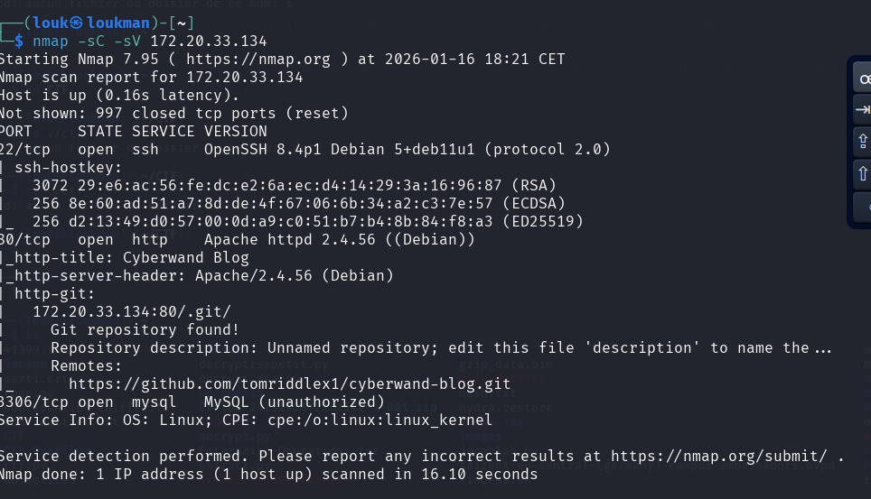
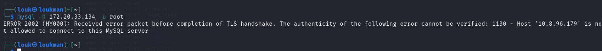

Description du Chall : 
Git is a version control system that supports multi-user collaboration by tracking code changes. The version control history of projects is stored in the ".git" folder.  
  
It is recommended for practicing directory discovery in a web application, detecting critical data by navigating between git branches, and gaining access to the server with a key file.

Comme cette description nous indique on va travaillez avec le depôt git

**Outil :** 

Nmap : 
wordlists : /usr/share/wordlists/dirb/common.txt 
git-dumper :  C'est un outil qui **télécharge récursivement** un dépôt Git exposé sur un serveur web. Il permet de télécharger en gros tout même les historiques. Une vulnérabilité du a l'exposition du dépôt **.git**
L'outil git-dumper est écrit en python 

Installation : 
**pip install git-dumper** 

Utilisation 
**git-dumper https://TARGER/.git/ /dossier_sorti** 

Etape :1 Enumération 
- Découverte de service et port ouvert ainsi que leur version

Commande :
nmap -sC -sV 172.20.33.134

On a 3 ports ouverts : le 3306 pour mysql , 22 pour le SSH et le 80 pour le HTTP 
Le scan nmap nous montre directement que le depôt .git est exposé . 

Essayons de nous connecter a mysql avec les defaults credentials root/root

Commande : 
mysql -u root -h 172.20.33.134 

L'acces a mysql est bloqué donc il ne sera pas le point d'entrée. 
NB : on n'a pas d'identifiant pour nous connecter a ssh donc on laisse d'abord

- Nmap
