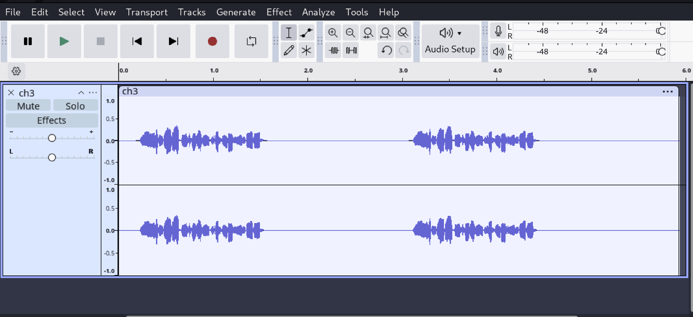
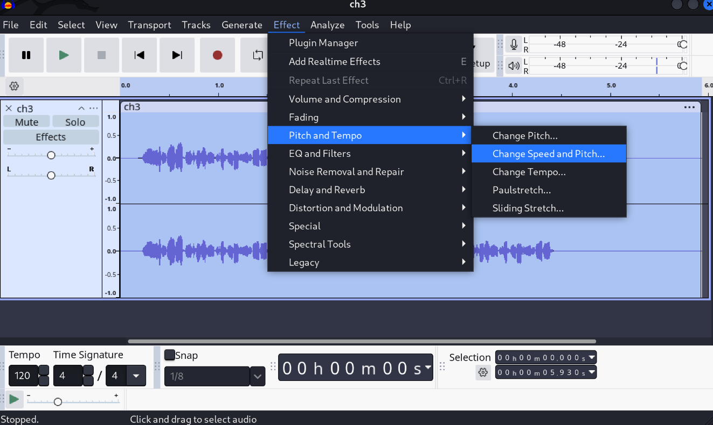
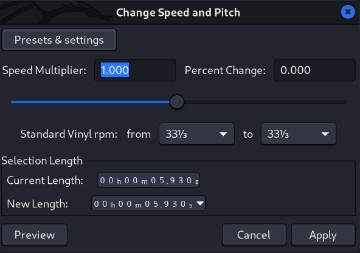
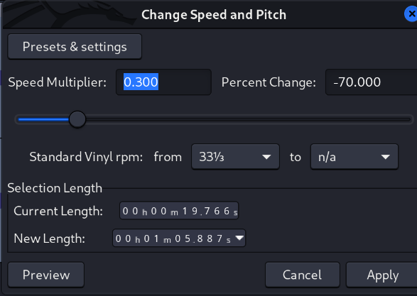
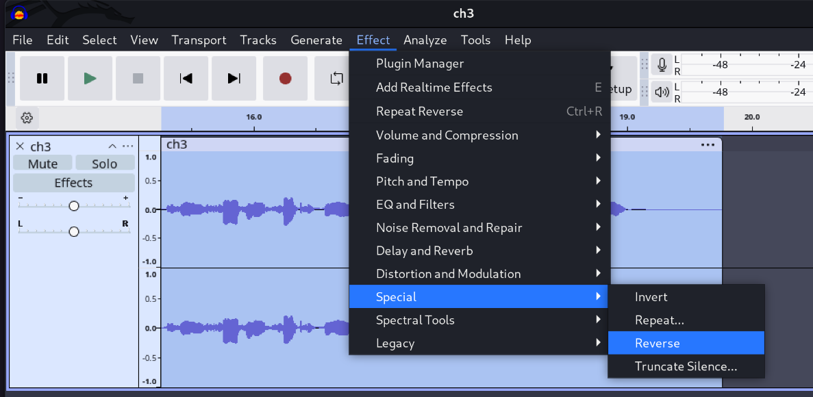

## Description du Challenge
- **Plateforme :** Root-Me
- **Nom du challenge :** WAV - Analyse de bruit
- **Fichier fourni :** `ch3.wav`

---

##  Analyse Initiale
En écoutant le fichier audio `ch3.wav`, on remarque immédiatement deux anomalies majeures :
1. Le son semble extrêmement **bruit brut et accéléré**.
2. Les paroles sont totalement inaudibles en l'état.

Nous allons utiliser le logiciel **Audacity** pour analyser et décortiquer le signal audio.

---

##  Résolution pas à pas

### Étape 1 : Importation du fichier
1. Ouvrez Audacity.
2. Utilisez le raccourci `Ctrl + Shift + I` (ou *Fichier > Importer > Audio*) pour charger le fichier `ch3.wav`.



---

### Étape 2 : Ralentir le flux audio
Le son étant trop rapide, il faut réduire sa vitesse pour distinguer le signal d'origine.

1. Sélectionnez l'intégralité de la piste audio avec le raccourci `Ctrl + A`.
2. Allez dans le menu : **Effect** ➡️ **Pitch and Tempo** ➡️ **Change Speed and Pitch** (ou *Change Speed* selon votre version).



3. Par défaut, le multiplicateur de vitesse est configuré à `1,000`.
   
4. Modifiez cette valeur pour la passer à **`0,300`** afin de ralentir l'audio de manière significative, puis validez.
   

---

### Étape 3 : Inverser le sens de lecture (Reverse)
Après avoir ralenti la piste, on distingue clairement une voix humaine, mais le langage reste incompréhensible (effet "backmasking"). L'audio a été enregistré à l'envers.

1. Assurez-vous que toute la piste est toujours sélectionnée (`Ctrl + A`).
2. Allez dans le menu : **Effect** ➡️ **Special** ➡️ **Reverse**.



---

## 🚩 Flag

En réécoutant la piste après application des effets, une voix claire récite distinctement le flag recherché.

```text
3b27641fc5h0
```
