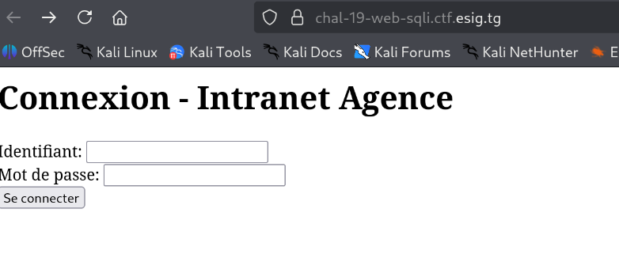
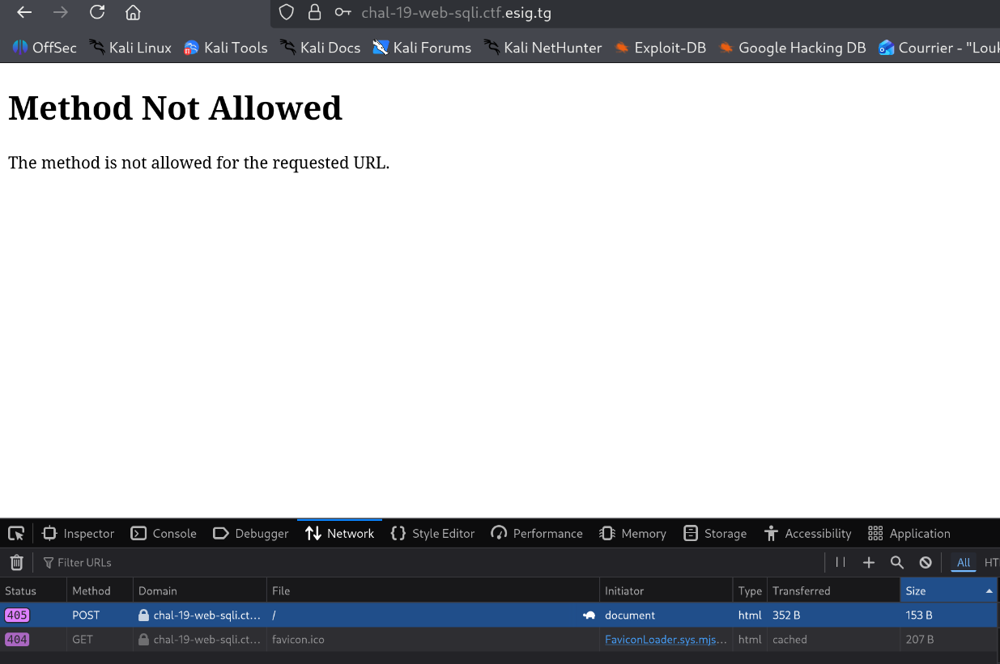
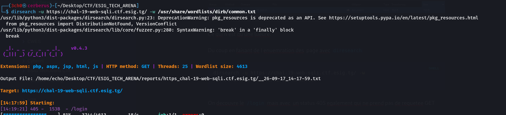
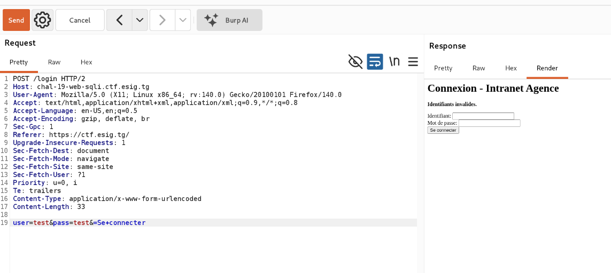
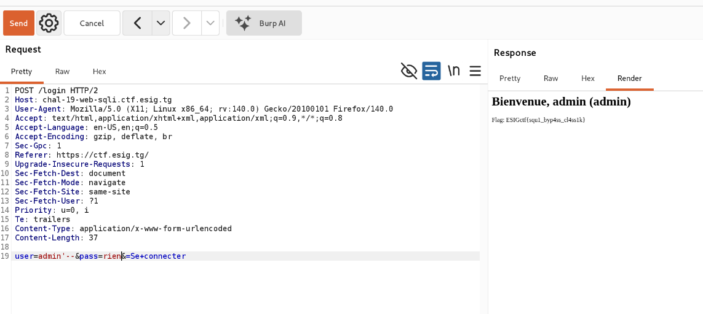

---

## 📝 Description
> Intranet de l'Agence. Le flag est réservé à l'admin.

Lorsqu'on accède à la page, on est soumis à une page de connexion classique.



---

## Étape 1 : Énumération et Découverte (Recon)

Lorsqu'on essaye une connexion basique pour tester le comportement de l'application, par exemple avec :
- **username** : `test`
- **password** : `test`

On remarque au cours de l'analyse de la requête que l'envoi du formulaire via une requête `POST` sur la racine (`/`) renvoie une **erreur HTTP 405 (Method Not Allowed)**. Cela indique que la méthode `POST` n'est pas autorisée directement à cet endroit.



> **Analyse**
> Ce comportement n'est qu'une lueur (une fausse piste ou une restriction de routage). L'application doit obligatoirement traiter l'authentification sur un autre point d'accès.

Du coup, en faisant de l'énumération de pages avec l'outil `dirsearch` et une wordlist standard :
```bash
dirsearch -u https://esig.tg -w /usr/share/wordlists/dirb/common.txt 
```

On découvre l'existence de la page `/login`. Cependant, celle-ci renvoie également un statut **405** si on tente d'y accéder en `GET`, car elle ne prend pas de requêtes de consultation standard.



---

##  Étape 2 : Interception et Modification de la Requête

Du coup, pour réussir à nous connecter, nous comprenons qu'il faut envoyer la requête `POST` directement sur le endpoint `/login`.

### Processus :
1. Lancer **Burp Suite**.
2. Utiliser l'outil **Proxy** pour intercepter la requête de connexion initiale.
3. Modifier manuellement la cible dans Burp Suite pour ajouter `/login` au lieu de `/` uniquement.

En testant à nouveau l'envoi avec les mêmes identifiants de test (`test/test`) sur la bonne URL `/login`, on remarque que la requête passe enfin. Le serveur nous retourne cette fois une réponse logique : **"Identifiants invalides"**.



---

##  Étape 3 : Exploitation (SQL Injection)

Vu que l'objectif consiste à nous connecter en tant qu'administrateur pour récupérer le flag, nous allons tenter un **Authentication Bypass** (contournement d'authentification) en exploitant une vulnérabilité de type injection SQL. L'idée est d'utiliser les caractères de commentaires pour invalider la suite de la vérification.

### Payload :
```text
user=admin'--&pass=rien
```

### Mécanisme SQL sous-jacent :

Lorsqu'on envoie ce payload, le serveur va injecter notre chaîne dans sa requête interne. Le caractère `'` ferme la chaîne attendue pour l'utilisateur, et les tirets `--` passent tout le reste de la ligne en commentaire. Le serveur ne va donc plus du tout vérifier les identifiants ni le mot de passe, et la requête devient fonctionnellement équivalente à :

```sql
SELECT * FROM users WHERE user='admin' -- Le reste du code (AND password='...') est ignoré
```

---

**Boom !** Le serveur valide l'injection, contourne la vérification du mot de passe et nous connecte directement sur la session de l'administrateur. Le flag s'affiche instantanément à l'écran.



### Flag

```
ESIGctf{squ1_byp4ss_cl4ss1k}
```
