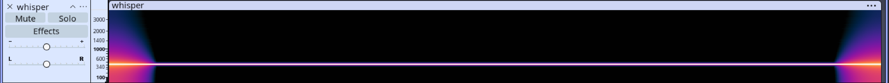

| Info       | Détail         |
| ---------- | -------------- |
| Plateforme | csplusplus     |
| Catégorie  | Stéganographie |
| Difficulté | Hard           |
| Auteur     | 3ch0           |

Description

A short WAV of a steady tone — but the flag is buried in the **least-significant bit of each 16-bit audio sample**.

Read the samples (e.g. Python's `wave` module), pull the low bit of each, and pack them into bytes (MSB first) until a null byte.

fichier fourni `whisper.wav`

Vu que nous avons un fichier WAV, nous avons commencer par utiiser l outil `audacity` pour analyser les spectogrames mais rien de bon



En lisant la description, ils nous parlent de lsb (Least Significant bit ou les bits les moins signifiants) une technique utiliser pour cacher les informations dans bits insignifiants du fichier audio

Nous allons ainsi utiliser l outil stegolsb  qui est un outil puissant utiliser pour extraire les  informations dans les lsb.

Installation

```
pip install stegolsb
```

Extraction

```

```
