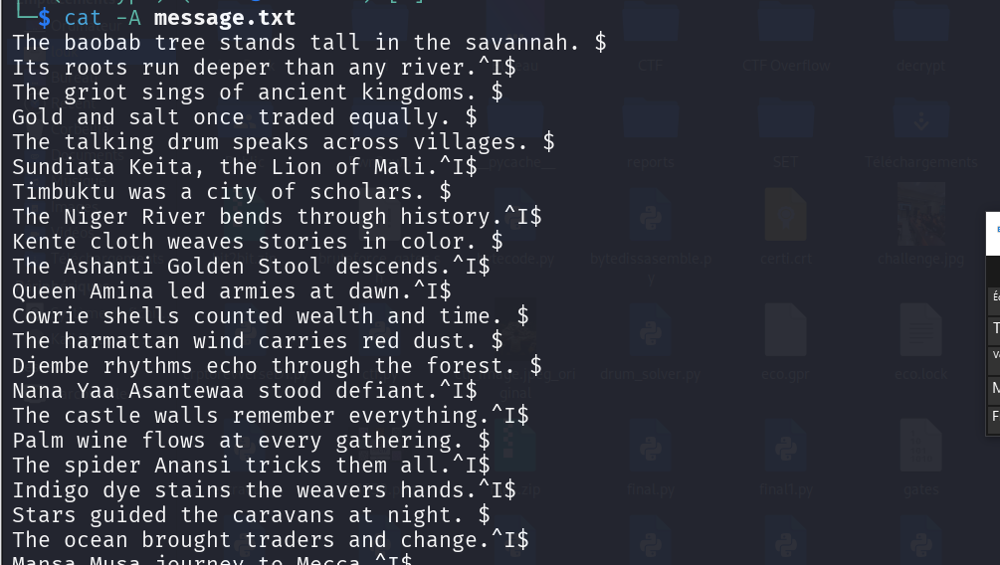

##### Message :
```
The baobab tree stands tall in the savannah. 
Its roots run deeper than any river.	
The griot sings of ancient kingdoms. 
Gold and salt once traded equally. 
The talking drum speaks across villages. 
Sundiata Keita, the Lion of Mali.	
Timbuktu was a city of scholars. 
The Niger River bends through history.	
Kente cloth weaves stories in color. 
The Ashanti Golden Stool descends.	
Queen Amina led armies at dawn.	
Cowrie shells counted wealth and time. 
The harmattan wind carries red dust. 
Djembe rhythms echo through the forest. 
Nana Yaa Asantewaa stood defiant.	
The castle walls remember everything.	
Palm wine flows at every gathering. 
The spider Anansi tricks them all.	
Indigo dye stains the weavers hands.	
Stars guided the caravans at night. 
The ocean brought traders and change.	
Mansa Musa journey to Mecca.	
Sacred groves guard old secrets well.	
The firefly lights the darkest path.	
A child cannot pay for mothers milk. 
The elephant never forgets its way.	
Iron bells ring for the ancestors.	
The leopard crouches before it leaps.	
Rain dances bring the clouds closer. 
Behind every old man is history.	
The mask speaks when the dancer moves.	
Wisdom is a baobab no one can hug.	
The river knows where it must go. 
Silence speaks louder than the drum.	
The moon watches over the village.	
The baobab tree stands tall in the savannah. 
Its roots run deeper than any river. 
The griot sings of ancient kingdoms. 
Gold and salt once traded equally. 
The talking drum speaks across villages.	
Sundiata Keita, the Lion of Mali. 
Timbuktu was a city of scholars.	
The Niger River bends through history.	
Kente cloth weaves stories in color.	
The Ashanti Golden Stool descends. 
Queen Amina led armies at dawn. 
Cowrie shells counted wealth and time.	
The harmattan wind carries red dust.	
Djembe rhythms echo through the forest. 
Nana Yaa Asantewaa stood defiant.	
The castle walls remember everything. 
Palm wine flows at every gathering. 
The spider Anansi tricks them all. 
Indigo dye stains the weavers hands. 
Stars guided the caravans at night.	
The ocean brought traders and change.	
Mansa Musa journey to Mecca. 
Sacred groves guard old secrets well.	
The firefly lights the darkest path. 
A child cannot pay for mothers milk.	
The elephant never forgets its way. 
Iron bells ring for the ancestors.	
The leopard crouches before it leaps. 
Rain dances bring the clouds closer. 
Behind every old man is history. 
The mask speaks when the dancer moves.	
Wisdom is a baobab no one can hug. 
The river knows where it must go. 
Silence speaks louder than the drum. 
The moon watches over the village.	
The baobab tree stands tall in the savannah.	
Its roots run deeper than any river. 
The griot sings of ancient kingdoms. 
Gold and salt once traded equally.	
The talking drum speaks across villages.	
Sundiata Keita, the Lion of Mali.	
Timbuktu was a city of scholars.	
The Niger River bends through history. 
Kente cloth weaves stories in color.	
The Ashanti Golden Stool descends.	
Queen Amina led armies at dawn. 
Cowrie shells counted wealth and time.	
The harmattan wind carries red dust.	
Djembe rhythms echo through the forest.	
Nana Yaa Asantewaa stood defiant. 
The castle walls remember everything.	
Palm wine flows at every gathering.	
The spider Anansi tricks them all.	
Indigo dye stains the weavers hands. 
Stars guided the caravans at night.	
The ocean brought traders and change.	
Mansa Musa journey to Mecca. 
Sacred groves guard old secrets well.	
The firefly lights the darkest path. 
A child cannot pay for mothers milk. 
The elephant never forgets its way. 
Iron bells ring for the ancestors. 
The leopard crouches before it leaps. 
Rain dances bring the clouds closer.	
Behind every old man is history.	
The mask speaks when the dancer moves. 
Wisdom is a baobab no one can hug. 
The river knows where it must go. 
Silence speaks louder than the drum.	
The moon watches over the village. 
The baobab tree stands tall in the savannah.	
Its roots run deeper than any river.	
The griot sings of ancient kingdoms.	
Gold and salt once traded equally. 
The talking drum speaks across villages.	
Sundiata Keita, the Lion of Mali. 
Timbuktu was a city of scholars. 
The Niger River bends through history. 
Kente cloth weaves stories in color. 
The Ashanti Golden Stool descends.	
Queen Amina led armies at dawn.	
Cowrie shells counted wealth and time. 
The harmattan wind carries red dust. 
Djembe rhythms echo through the forest.	
Nana Yaa Asantewaa stood defiant.	
The castle walls remember everything. 
Palm wine flows at every gathering.	
The spider Anansi tricks them all.	
Indigo dye stains the weavers hands.	
Stars guided the caravans at night. 
The ocean brought traders and change. 
Mansa Musa journey to Mecca.	
Sacred groves guard old secrets well.	
The firefly lights the darkest path. 
A child cannot pay for mothers milk.	
The elephant never forgets its way.	
Iron bells ring for the ancestors.	
The leopard crouches before it leaps. 
Rain dances bring the clouds closer. 
Behind every old man is history. 
The mask speaks when the dancer moves. 
Wisdom is a baobab no one can hug. 
The river knows where it must go. 
Silence speaks louder than the drum.	
The moon watches over the village.	
The baobab tree stands tall in the savannah. 
Its roots run deeper than any river.	
The griot sings of ancient kingdoms. 
Gold and salt once traded equally. 
The talking drum speaks across villages. 
Sundiata Keita, the Lion of Mali.	
Timbuktu was a city of scholars.	
The Niger River bends through history. 
Kente cloth weaves stories in color. 
The Ashanti Golden Stool descends. 
Queen Amina led armies at dawn.	
Cowrie shells counted wealth and time.	
The harmattan wind carries red dust. 
Djembe rhythms echo through the forest. 
Nana Yaa Asantewaa stood defiant.	
The castle walls remember everything.	
Palm wine flows at every gathering. 
The spider Anansi tricks them all. 
Indigo dye stains the weavers hands.	
Stars guided the caravans at night.	
The ocean brought traders and change. 
Mansa Musa journey to Mecca.	
Sacred groves guard old secrets well. 
The firefly lights the darkest path.	
A child cannot pay for mothers milk.	
The elephant never forgets its way.	
Iron bells ring for the ancestors.	
The leopard crouches before it leaps.	
Rain dances bring the clouds closer. 
Behind every old man is history.	
The mask speaks when the dancer moves.	
Wisdom is a baobab no one can hug. 
The river knows where it must go.	
Silence speaks louder than the drum. 
The moon watches over the village. 
The baobab tree stands tall in the savannah. 
Its roots run deeper than any river. 
The griot sings of ancient kingdoms. 
Gold and salt once traded equally.	
The talking drum speaks across villages.	
Sundiata Keita, the Lion of Mali. 
Timbuktu was a city of scholars. 
The Niger River bends through history. 
Kente cloth weaves stories in color.	
The Ashanti Golden Stool descends. 
Queen Amina led armies at dawn.	
Cowrie shells counted wealth and time.	
The harmattan wind carries red dust. 
Djembe rhythms echo through the forest. 
Nana Yaa Asantewaa stood defiant.	
The castle walls remember everything. 
Palm wine flows at every gathering. 
The spider Anansi tricks them all. 
Indigo dye stains the weavers hands. 
Stars guided the caravans at night.	
The ocean brought traders and change.	
Mansa Musa journey to Mecca. 
Sacred groves guard old secrets well. 
The firefly lights the darkest path.	
A child cannot pay for mothers milk.	
The elephant never forgets its way. 
Iron bells ring for the ancestors.	
The leopard crouches before it leaps.	
Rain dances bring the clouds closer.	
Behind every old man is history. 
The mask speaks when the dancer moves. 
Wisdom is a baobab no one can hug.	
The river knows where it must go.	
Silence speaks louder than the drum. 
The moon watches over the village.	
The baobab tree stands tall in the savannah. 
Its roots run deeper than any river.	
The griot sings of ancient kingdoms.	
Gold and salt once traded equally.	
The talking drum speaks across villages.	
Sundiata Keita, the Lion of Mali.	
Timbuktu was a city of scholars. 
The Niger River bends through history.	
Kente cloth weaves stories in color.	
The Ashanti Golden Stool descends.	
Queen Amina led armies at dawn. 
Cowrie shells counted wealth and time. 
The harmattan wind carries red dust.	
Djembe rhythms echo through the forest.	
Nana Yaa Asantewaa stood defiant. 
The castle walls remember everything. 
Palm wine flows at every gathering.	
The spider Anansi tricks them all.	
Indigo dye stains the weavers hands. 
Stars guided the caravans at night. 
The ocean brought traders and change.	
Mansa Musa journey to Mecca.	
Sacred groves guard old secrets well. 
The firefly lights the darkest path.	
A child cannot pay for mothers milk.	
The elephant never forgets its way. 
Iron bells ring for the ancestors. 
The leopard crouches before it leaps. 
Rain dances bring the clouds closer.	
Behind every old man is history.	
The mask speaks when the dancer moves. 
Wisdom is a baobab no one can hug.	
The river knows where it must go.	
Silence speaks louder than the drum.	
The moon watches over the village. 
The baobab tree stands tall in the savannah. 
Its roots run deeper than any river.	
The griot sings of ancient kingdoms. 
Gold and salt once traded equally. 
The talking drum speaks across villages. 
Sundiata Keita, the Lion of Mali.	
Timbuktu was a city of scholars.	
The Niger River bends through history. 
Kente cloth weaves stories in color. 
The Ashanti Golden Stool descends.	
Queen Amina led armies at dawn.	
Cowrie shells counted wealth and time. 
The harmattan wind carries red dust.	
Djembe rhythms echo through the forest.	
Nana Yaa Asantewaa stood defiant.	
The castle walls remember everything. 
Palm wine flows at every gathering.	
The spider Anansi tricks them all. 
Indigo dye stains the weavers hands. 
Stars guided the caravans at night. 
The ocean brought traders and change.	
Mansa Musa journey to Mecca.	
Sacred groves guard old secrets well.	
The firefly lights the darkest path. 
A child cannot pay for mothers milk. 
The elephant never forgets its way.	
Iron bells ring for the ancestors.	
The leopard crouches before it leaps. 
Rain dances bring the clouds closer.	
Behind every old man is history.	
The mask speaks when the dancer moves.	
Wisdom is a baobab no one can hug.	
The river knows where it must go.	
Silence speaks louder than the drum. 
The moon watches over the village.	

```

#### Etape 1- Analyse du message

L'utilisation de la commande `cat -A message.txt` est l'étape cruciale. Elle révèle que le fichier n'est pas un simple fichier texte de proverbes, mais un porteur d'informations binaires.

- **Espace ( ) avant le `$`** : Interprété comme un bit **0**.
    
- **Tabulation (`^I`) avant le `$`** : Interprété comme un bit **1**.
    

Chaque ligne du texte fournit exactement 1 bit. En regroupant ces bits par paquets de 8, on peut reconstruire les caractères ASCII du flag.



#### Etape 2- Exploitation

Script python d'exploitation

```
def solve_stego():
    bits = ""
    with open("message.txt", "rb") as f:
        for line in f:
            # On nettoie les caractères de fin de ligne Windows/Linux (\r\n ou \n)
            # pour ne garder que le dernier caractère "invisible"
            content = line.replace(b'\r', b'').replace(b'\n', b'')
            
            if content.endswith(b'\t'):
                bits += "1"
            elif content.endswith(b' '):
                bits += "0"
    
    # Conversion du flux binaire en texte ASCII
    flag = ""
    for i in range(0, len(bits), 8):
        byte = bits[i:i+8]
        if len(byte) == 8:
            flag += chr(int(byte, 2))
            
    return flag

print("Extraction du flag en cours...")
print(f"🚩 FLAG : {solve_stego()}")
```

#### Flag 🚩

> **Success**
> **`EcowasCTF{wh1t3sp4c3_h1d3s_s3cr3ts}`**
