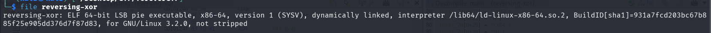
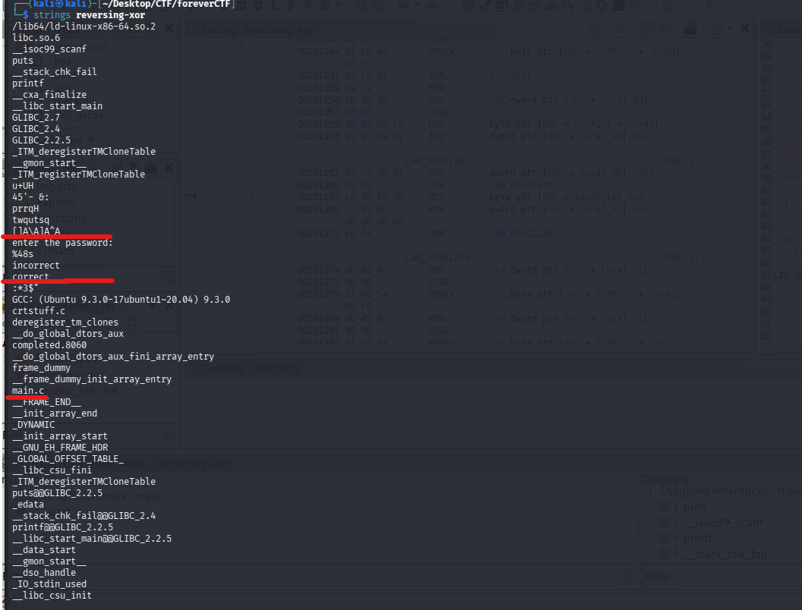
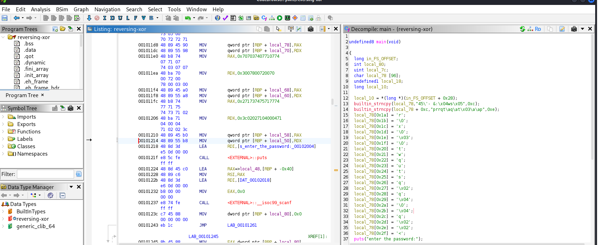
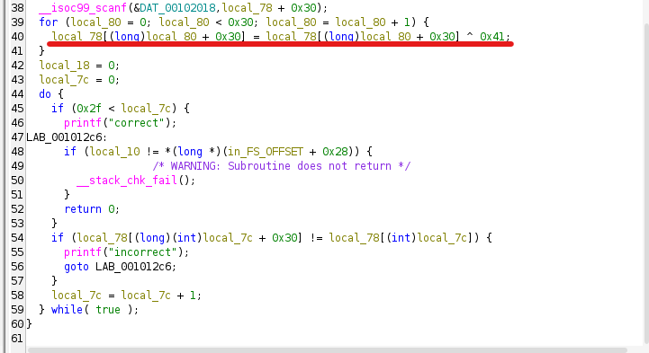
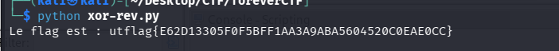

## 📝 Description du Challenge

> **Description :** I think the flag is encrypted in the binary. Could you figure out how to decypt it?
> 
> **Fichier :** `reversing-xor`
> 
> **Auteur :** Dan

Le challenge nous fournit un binaire Linux. Contrairement au challenge d'initiation précédent, le flag est ici chiffré à l'intérieur de l'exécutable. L'objectif est de comprendre l'algorithme employé pour inverser la protection.

## 🔍 1. Reconnaissance & Analyse Statique Initiale

Avant de plonger dans un décompilateur, la première étape indispensable est de cartographier le fichier à l'aide des outils en ligne de commande.

### Vérification du format du fichier

```
file reversing-xor
```



Le retour indique qu'il s'agit d'un exécutable Linux standard (**ELF**) 64 bits, non épuré (_not stripped_).

### Extraction des chaînes de caractères imprimables

Pour essayer de comprendre le fonctionnement global ou détecter des indices avant de désassembler, nous utilisons l'utilitaire `strings`.

```bash
strings reversing-xor
```



L'analyse de la sortie montre plusieurs éléments suspects :

- Les chaînes de texte `"enter the password:"`, `"%48s"`, `"incorrect"`, et `"correct"`.
    
- Des morceaux de texte étranges comme `"45'- &:"` et `"twqutsq"`.
- La présence d'une fonction **main** 
    

Cela confirme que le binaire attend une entrée utilisateur de 48 caractères maximum, qu'il va la traiter, puis valider ou rejeter le mot de passe.

## 💥 2. Reverse Engineering Approfondi (Ghidra)

Pour comprendre la logique exacte de validation, nous importons le binaire dans le décompilateur **Ghidra** pour analyser la fonction `main`.

```
// Aperçu de la logique décompilée dans Ghidra
builtin_strncpy(local_78,"45\'- &:\x04ws\x05",0xc);
builtin_strncpy(local_78 + 0xc,"prrqt\aq\at\x03\a\ap",0xe);
// ... [Affectations manuelles d'octets de 0x1a à 0x2f] ...

puts("enter the password:");
__isoc99_scanf(&DAT_00102018,local_78 + 0x30);

for (local_80 = 0; local_80 < 0x30; local_80 = local_80 + 1) {
    local_78[(long)local_80 + 0x30] = local_78[(long)local_80 + 0x30] ^ 0x41;
}
```



### Analyse de l'algorithme :

1. **La cible en mémoire :** Le programme prépare un tableau sur la pile et y injecte une suite de 48 octets (`0x30`) obfusqués (mélange de `strncpy` et d'affectations index par index).
    
2. **L'opération XOR ($\oplus$) :** L'application récupère notre entrée via `scanf` et applique une boucle qui effectue une opération **XOR avec la clé fixe `0x41`** (le caractère `'A'`) sur chacun de nos caractères.
    
3. **La comparaison :** Le binaire compare ensuite notre entrée modifiée avec la chaîne obfusquée du début.
    

Le chiffrement XOR étant **symétrique**, appliquer un XOR avec `0x41` sur la chaîne obfusquée d'origine permet de retrouver instantanément le mot de passe en clair.

##  3. Écriture du Script de Déchiffrement

Un script Python a été conçu pour reproduire l'état de la mémoire obfusquée et appliquer l'opération inverse ($Chiffré \oplus 0x41 = Clair$) :

```
# Reconstitution de la mémoire d'origine d'après Ghidra
part1 = b"45\'- &:\x04ws\x05"
part2 = b"prrqt\x07q\x07t\x03\x07\x07p" # \a vaut 0x07 en C

encrypted = bytearray(part1 + part2)

# Remplissage des affectations manuelles index par index
mapping = {
    0x1a: b'r', 0x1b: b'\x00', 0x1c: b'x', 0x1d: b'\x00', 
    0x1e: b'\x03', 0x1f: b'\x00', 0x20: b't', 0x21: b'w', 
    0x22: b'q', 0x23: b'u', 0x24: b't', 0x25: b's', 
    0x26: b'q', 0x27: b'\x02', 0x28: b'q', 0x29: b'\x04', 
    0x2a: b'\x00', 0x2b: b'\x04', 0x2c: b'q', 0x2d: b'\x02', 
    0x2e: b'\x02', 0x2f: b'<'
}

while len(encrypted) < 48:
    encrypted.append(0)

for index, val in mapping.items():
    encrypted[index] = ord(val)

# Déchiffrement par XOR
flag = "".join(chr(byte ^ 0x41) for byte in encrypted)
print(f"Le flag est : {flag}")
```

## 🏁 4. Extraction du Flag

Nous écrivons le script dans un fichier `xor-rev.py` et l'exécutons directement.

```bash
python3 xor-rev.py
```



**Flag récupéré :**

```
utflag{E62D13305F0F5BFF1AA3A9ABA5604520C0EAE0CC}
```

**_3ch0 training_**
