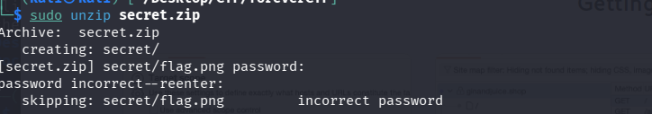
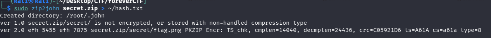
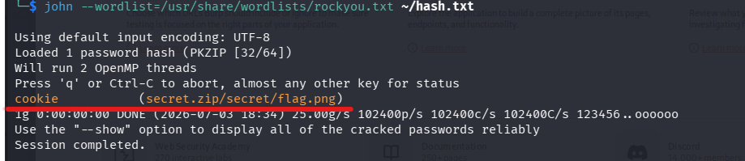
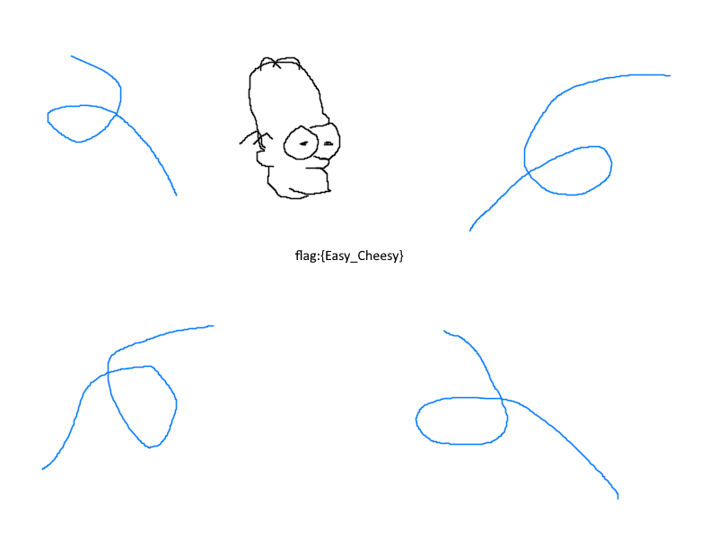

## 📝 Description du Challenge

> **Description :** I found this old ZIP archive on my computer, I think it has a really useful flag inside. Can you figure out how to open it? I remember that I used a pretty common password.
> 
> **Fichier :** `secret.zip`
> 
> **Auteur :** balex

Nous disposons d'une archive compressée `secret.zip` protégée par un mot de passe. L'auteur précise qu'il a utilisé un mot de passe très commun, ce qui nous oriente vers une attaque par dictionnaire.

##  1. Phase d'Énumération et Impasses

Au cours de l'investigation, plusieurs outils de stéganographie et d'analyse ont été testés pour écarter d'autres pistes :

- **`unzip`** : Tente d'extraire le fichier `secret/flag.png` mais se heurte à une demande de mot de passe.
    
- **`exiftool`** : Confirme les métadonnées de l'archive (format ZIP standard) sans révéler de mot de passe caché dans les commentaires.
    
- **`binwalk`** : Renvoie une erreur de permissions liée au répertoire de destination.
    
- **`stegseek` / `steghide`** : Indiquent à juste titre que le format `.zip` n'est pas pris en charge par ces outils spécifiques à la stéganographie d'images ou d'audio.
    


##  2. Extraction du Hash et Attaque par Dictionnaire

Puisque l'archive chiffre le fichier interne `flag.png`, nous devons récupérer l'empreinte cryptographique (hash) du mot de passe de l'archive afin de pouvoir la soumettre à un casseur de mots de passe hors-ligne.

### Étape 1 : Extraction du hash avec `zip2john`

Nous utilisons l'outil de la suite John The Ripper dédié aux archives ZIP :

```bash
sudo zip2john secret.zip > ~/hash.txt
```



L'outil confirme la détection d'un chiffrement de type `PKZIP Encr` sur le fichier `flag.png`.

### Étape 2 : Cracking du hash avec `john`

L'énoncé mentionnant un mot de passe « très commun », nous employons le dictionnaire **`rockyou.txt`** intégré par défaut dans Kali Linux.

```
john --wordlist=/usr/share/wordlists/rockyou.txt ~/hash.txt
```



**Résultat du cracking :**

```
cookie           (secret.zip/secret/flag.png)
1g 0:00:00:00 DONE
```

Le mot de passe de l'archive est **`cookie`**.

## 3. Extraction du Contenu

Muni du mot de passe valide, nous pouvons maintenant procéder à l'extraction de l'image contenant le flag.

```bash
sudo unzip secret.zip
```

**Console :**

```
Archive:  secret.zip
[secret.zip] secret/flag.png password: cookie
  inflating: secret/flag.png 
```

## 🏁 4. Capture du Flag

Une fois le fichier `flag.png` extrait dans le dossier `secret/`, il ne reste plus qu'à l'ouvrir graphiquement pour y lire le flag.

```bash
open secret/flag.png
```



**Flag récupéré :**

```
utflag{the_hashcats_pajamas}
```

**_3ch0 training_**
